# Установка Zabbix и начало работы с использованием фронтенда

Zabbix 6 является продолжением Zabbix 5, поскольку на этот раз мы не видим больших изменений в пользовательском интерфейсе. Тем не менее, в Zabbix 6 вы найдете множество улучшений, как в пользовательском интерфейсе, так и в основных компонентах. Например, введение высокой доступности для сервера Zabbix. Мы подробно опишем все важные изменения на протяжении всей книги.

В этой главе мы установим сервер Zabbix и изучим пользовательский интерфейс Zabbix, чтобы познакомить вас с ним. Мы рассмотрим поиск хостов, триггеров, приборных панелей и многое другое, чтобы вы чувствовали себя уверенно, погружаясь глубже в материал в этой книги. Пользовательский интерфейс Zabbix имеет множество возможностей для изучения, поэтому, если вы только начинаете, не расстраивайтесь. Он достаточно структурно построен, и как только вы освоитесь, я уверен, что вы без проблем найдете свой путь. Вы узнаете все об этих темах в следующих рецептах:

* Установка сервера Zabbix

* Настройка фронтенда Zabbix

* Включение высокой доступности сервера Zabbix
* Использование фронтенда Zabbix
* Навигация по фронтенду Zabbix

## Технические требования

Мы начнем эту главу с пустой Linux (виртуальной) машины. Не стесняйтесь выбрать дистрибутив Linux на базе RHEL или Debian. Затем мы настроим сервер Zabbix с нуля на этом хосте.

Поэтому, прежде чем приступить к работе, убедитесь, что у вас есть готовый Linux-хост.

## Установка сервера Zabbix

Прежде чем что-либо делать в Zabbix, нам необходимо установить его и подготовиться к работе с ним. В этом рецепте мы узнаем, как установить Zabbix server 6.

### Подготовка

Прежде, чем мы установим сервер Zabbix, нам нужно будет выполнить некоторые предварительные требования. В этой книге мы будем использовать в основном **MariaDB**. MariaDB популярна, и имеется много информации по ее использованию с Zabbix.

На данный момент перед вами должен быть подготовленный Linux-сервер под управлением дистрибутива на базе RHEL или Debian. Я буду устанавливать на свой сервер CentOS и Ubuntu 20.04; назовем их `lar-book-centos` и `lar-book-ubuntu`.

Когда вы подготовите свой сервер, мы можем начать процесс установки.

### Как это сделать...

1. Начнем с добавления репозитория Zabbix 6.0 в нашу систему.

    Для систем на основе RHEL:

`````
rpm -Uvh https://repo.zabbix.com/zabbix/6.0/rhel/8/
x86_64/zabbix-release-6.0-1.el8.noarch.rpm

dnf clean all
`````

    Для систем Ubuntu:

```
wget https://repo.zabbix.com/zabbix/6.0/ubuntu/pool/
main/z/zabbix-release/zabbix-release_6.0-1+ubuntu20.04_ all.deb

dpkg -i zabbix-release_6.0-1+ubuntu20.04_all.deb
apt update
```

2. Теперь, когда репозиторий добавлен, давайте добавим репозиторий MariaDB на наш сервер:

```
wget https://downloads.mariadb.com/MariaDB/mariadb_repo_setup
chmod +x mariadb_repo_setup
./mariadb_repo_setup
```

3. Затем установите и включите его с помощью следующих команд:

    Для систем на базе RHEL:

```
dnf install mariadb-server
systemctl enable mariadb
systemctl start mariadb
```

    Для систем Ubuntu:

```
apt install mariadb-server
systemctl enable mariadb
systemctl start mariadb
```

4. После установки MariaDB убедитесь, что ваша установка защищена, выполнив следующую команду:

`/usr/bin/mariadb-secure-installation`

5. Обязательно отвечайте на вопросы "Yes" (Y) и настройте надежный пароль root.

6. Выполните настройку безопасной установки и обязательно сохраните где-нибудь свой пароль. Настоятельно рекомендуется использовать хранилище паролей.

7. Теперь давайте установим наш сервер Zabbix с поддержкой MySQL. Для систем на базе RHEL:

`dnf install zabbix-server-mysql zabbix-sql-scripts`

Для Ubuntu систем:

`apt install zabbix-server-mysql zabbix-sql-scripts`

8. После установки сервера Zabbix мы готовы к созданию базы данных Zabbix. Войдите в MariaDB со следующими параметрами:

`mysql -u root -p`

9. Введите пароль, который вы установили во время безопасной установки, и создайте базу данных Zabbix с помощью следующих команд. Не забудьте изменить `password` во второй команде:

```
create database zabbix character set utf8mb4 collate utf8mb4_bin;
create user zabbix@localhost identified by 'password';
grant all privileges on zabbix.\* to zabbix@localhost identified by 'password';
flush privileges;
quit
```

<table border="1" width="100%" cellpadding="5">
  <tr>
    <td>
    <p><b>Подсказка</b></p>
<p>Для тех, кому это может понадобиться, Zabbix теперь также поддерживает <code>utf8mb4</code>. Мы изменили <code>utf8</code> на <code>utf8mb4</code> в приведенной выше команде, и все будет работать. Для справки проверьте тикет поддержки Zabbix здесь: <a href="https://support.zabbix.com/browse/ZBXNEXT-3706">https://support.zabbix.com/browse/ZBXNEXT-3706</a>.</p>
    </td>
  </tr>
</table>

10. Теперь нам нужно импортировать нашу схему базы данных Zabbix в нашу вновь созданную базу данных Zabbix:

```
zcat /usr/share/doc/zabbix-sql-scripts/mysql/server.sql.gz | mysql -u zabbix -p zabbix
```

<table border="1" width="100%" cellpadding="5">
  <tr>
    <td>
    <p><b>Важное замечание</b></p>
<p>На этом этапе может показаться, что вы застряли и система не отвечает. Однако не волнуйтесь, поскольку импорт схемы SQL займет некоторое время.</p>
    </td>
  </tr>
</table>

Теперь мы закончили подготовку нашей стороны MariaDB и готовы перейти к следующему шагу - настройке сервера Zabbix:

1. Сервер Zabbix настраивается с помощью файла конфигурации сервера Zabbix. Этот файл находится в каталоге `/etc/zabbix/`. Давайте откроем этот файл с помощью нашего любимого редактора; я буду использовать Vim на протяжении всей книги:

```
vim /etc/zabbix/zabbix_server.conf
```

2. Теперь убедитесь, что следующие строки в файле соответствуют имени вашей базы данных, имени пользователя базы данных и паролю пользователя базы данных:

```
DBName=zabbix
DBUser=zabbix
DBPassword=password
```

<table border="1" width="100%" cellpadding="5">
  <tr>
    <td>
    <p><b>Подсказка</b></p>
<p>Перед запуском сервера Zabbix необходимо настроить SELinux или AppArmor, чтобы разрешить использование сервера Zabbix. Если это тестовая машина, вы можете использовать разрешающую позицию для SELinux или отключить AppArmor, но рекомендуется не делать этого в производстве.</p>
</td>
</tr>
</table>

3.	Все готово; теперь мы готовы запустить наш сервер Zabbix:

```
systemctl enable zabbix-server
systemctl start zabbix-server
```

4. Проверьте, все ли запускается, как ожидалось, следующим образом: `systemctl status zabbix-server`.

5. В качестве альтернативы просмотрите файл журнала, в котором содержится подробное описание процесса запуска Zabbix:

```
tail -f /var/log/zabbix/zabbix_server.log
```

6. Большинство сообщений в этом файле в порядке, и их можно спокойно игнорировать, но обязательно хорошо прочитайте и посмотрите, нет ли проблем с запуском вашего сервера Zabbix.

### Как это работает...

Сервер Zabbix - это основной процесс нашей установки Zabbix. Он отвечает за мониторинг, оповещение о проблемах и многие другие задачи, описанные в этой книге. Полный стек Zabbix состоит как минимум из следующего:

* База данных (MySQL, PostgreSQL или Oracle)

* сервер Zabbix

* Apache или NGINX, на котором запущен фронтенд Zabbix с PHP 7.2+, но PHP 8 в настоящее время не поддерживается.

Мы можем увидеть компоненты и то, как они взаимодействуют друг с другом, на следующем рисунке:


Рисунок 1.1 - Диаграмма коммуникаций при настройке Zabbix

Мы только что настроили сервер Zabbix и базу данных; запустив их, мы практически готовы начать мониторинг. Сервер Zabbix взаимодействует с базой данных Zabbix для записи в нее собранных значений.

Однако остается одна проблема: мы не можем подключить наш сервер Zabbix к базе данных.

Для этого нам понадобится наш фронтенд Zabbix, который мы настроим в следующем рецепте.

## Настройка фронтенда Zabbix

Фронтенд Zabbix - это лицо нашего сервера. Это место, куда мы будем подключать все наши хосты, шаблоны, приборные панели, карты и все остальное. Без него мы были бы слепы к тому, что происходит на стороне сервера. Итак, давайте настроим наш фронтенд Zabbix в этом рецепте.

### Готовность

Мы собираемся настроить фронтенд Zabbix с помощью Apache. Прежде чем приступить к этому рецепту, убедитесь, что вы запустили сервер Zabbix на выбранном вами дистрибутиве Linux. В этих рецептах я буду использовать хосты `lar-book-centos` и `lar-book-ubuntu`, чтобы показать процесс настройки на CentOS 8 и Ubuntu 20.

### Как это сделать...

1. Давайте сразу же приступим к установке фронтенда. Для начала работы выполните следующую команду.

Для систем на базе RHEL:

```
dnf install zabbix-web-mysql zabbix-apache-conf
```

Для систем на базе Ubuntu:

```
apt install zabbix-frontend-php zabbix-apache-conf
```

<table border="1" width="100%" cellpadding="5">
  <tr>
    <td>
    <p><b>Подсказка</b></p>
<p>Не забудьте разрешить порты 80 и 443 в вашем брандмауэре, если вы его используете. Без этого вы не сможете подключиться к фронтенду.</p>
    </td>
  </tr>
</table>

2. Перезапустите компоненты Zabbix и убедитесь, что они запускаются при загрузке сервера, выполнив следующие действия.

Для систем на базе RHEL:

```
systemctl enable httpd php-fpm
systemctl restart zabbix-server httpd php-fpm
```

Для систем на базе Ubuntu:

```
systemctl enable apache2
systemctl restart zabbix-server apache2
```

3. Теперь мы должны быть в состоянии перейти к нашему фронтенду Zabbix без каких-либо проблем и начать последние шаги по настройке фронтенда Zabbix.

4. Откроем браузер и перейдем к IP-адресу нашего сервера. Он должен выглядеть следующим образом:

```
http://<ваш_сервер_ip>/zabbix
```

5.	Теперь мы должны увидеть следующую веб-страницу:

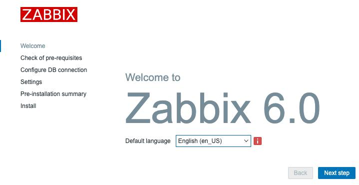

Рисунок 1.2 - Экран приветствия Zabbix

Если вы не видите эту веб-страницу, возможно, вы пропустили некоторые шаги в процессе настройки. Проследите за своими действиями и перепроверьте конфигурационные файлы; даже самая маленькая опечатка может помешать отображению веб-страницы.

6. Продолжим, нажав **Следующий шаг** на этой странице, что приведет к открытию следующей страницы:


Рисунок 1.3 - Страница предварительных условий установки Zabbix

7. Каждая опция здесь должна показывать **OK**; если это не так - исправьте ошибку, которую она вам показывает. Если все **OK** - вы можете продолжить, снова нажав **Следующий шаг**, что приведет вас на следующую страницу:


Рисунок 1.4 - Страница подключения к БД установки Zabbix

8. Здесь нам нужно указать фронтенду Zabbix где находится наша база данных MySQL. Поскольку мы установили ее на **localhost** - нам просто нужно убедиться, что мы указали правильное имя базы данных, имя пользователя базы данных и пароль пользователя базы данных.

9. Это должно обеспечить связь фронтенда Zabbix с базой данных. Давайте продолжим, снова нажав **Следующий шаг**:


Рисунок 1.5 - Страница подробной информации об установочном сервере Zabbix

Следующим шагом будет настройка сервера Zabbix. Обязательно назовите ваш сервер как-нибудь понятно или как-нибудь круто. Например, я настроил рабочий сервер под названием `Meeseeks`, потому что каждый раз, когда мы получали оповещение, мы могли заставить Zabbix сказать _"Я мистер Meeseeks, посмотрите на меня."_ Но что-то вроде `zabbix.example.com` тоже подойдет.

10. Давайте назовем наш сервер, установим часовой пояс в соответствии с нашим собственным часовым поясом и перейдем к следующему шагу:


Рисунок 1.6 - Краткая страница установки Zabbix

11. Проверьте настройки и еще раз нажмите **Следующий шаг**.


Рисунок 1.7 - Страница завершения установки Zabbix

12. Вы успешно установили фронтенд Zabbix. Теперь вы можете нажать кнопку **Finish** и мы можем начать использовать фронтенд. Перед вами откроется страница входа в систему, где вы можете использовать следующие учетные данные по умолчанию:

```
Имя пользователя: Admin
Пароль: zabbix
```

### Как это работает...

Теперь, когда мы установили наш фронтенд Zabbix, наша установка Zabbix завершена, и мы готовы начать работу с ним. Наш фронтенд Zabbix подключится к нашей базе данных для редактирования значений конфигурации установки, как мы можем видеть в следующем рисунке:


Рисунок 1.8 - Диаграмма связи с установкой Zabbix

Фронтенд Zabbix также будет общаться с нашим сервером Zabbix, но только для того, чтобы убедиться, что сервер Zabbix запущен и работает. Теперь, когда мы знаем, как настроить фронтенд Zabbix, мы можем начать его использовать. Давайте проверим это после следующего рецепта.

### Еще кое-что...

Zabbix предоставляет очень удобное руководство по настройке, содержащее много подробностей относительно установки Zabbix. Я всегда рекомендую держать эту страницу открытой во время установки Zabbix, поскольку она содержит такую информацию, как ссылка на последний репозиторий. Посмотрите ее здесь:

https://www.zabbix.com/download

## Включение высокой доступности сервера Zabbix

Zabbix 6 уже здесь, с одной из самых ожидаемых функций за все время. Высокая доступность выведет вашу установку Zabbix на новый уровень, гарантируя, что если один из ваших серверов Zabbix испытывает проблемы, другой сервер возьмет на себя его функции.

Замечательной особенностью этой реализации является то, что она поддерживает простой собственный способ объединения от одного до нескольких серверов Zabbix в кластер. Отличный способ убедиться, что ваш мониторинг всегда остается в воздухе (или, по крайней мере, настолько, насколько это возможно).

Теперь я должен быть честен, мы пока не можем сделать ничего подобного балансировке нагрузки. Но это включено в дорожную карту Zabbix с использованием прокси-серверов Zabbix в более поздней версии. Следите за обновлениями по этому поводу здесь:

https://www.zabbix.com/roadmap

### Готовность

Прежде чем приступить к работе, обратите внимание, что создание установки высокой доступности считается продвинутой темой. Она может оказаться сложнее, чем другие рецепты в этой главе.

Для этой установки нам понадобятся три новые виртуальные машины, поскольку мы собираемся создать раздельную установку Zabbix, в отличие от установки, которую мы создали в первом рецепте этой главы. Давайте посмотрим, как я назвал наши три новые виртуальные машины и какими будут их IP-адреса:

* `lar-book-ha1 (192.168.0.1)`

* `lar-book-ha2 (192.168.0.2)`

* `lar-book-ha-db (192.168.0.10)`

На двух из этих серверов будет работать наш кластер серверов Zabbix и фронтенд Zabbix. Другой сервер предназначен только для нашей базы данных MySQL. Обратите внимание, что IP-адреса, использованные в примере, могут быть другими. Используйте правильные для вашей среды.

Нам также понадобится виртуальный IP-адрес для наших узлов кластера. В примере мы будем использовать `192.168.0.5`.

<table border="1" width="100%" cellpadding="5">
  <tr>
    <td>
    <p><b>Совет</b></p>
<p>В нашей установке мы используем только одну базу данных MySQL Zabbix. Для обеспечения высокой доступности всех частей Zabbix, возможно, стоит рассмотреть возможность настройки MySQL в режиме master/master. Это будет отличным сочетанием с высокой доступностью сервера Zabbix.</p>
    </td>
  </tr>
</table>

В этом руководстве НЕ используется SELinux или AppArmor, поэтому перед использованием данного руководства убедитесь, что они отключены или добавлены правильные политики. Кроме того, в этом руководстве не описано, как настроить брандмауэр, поэтому убедитесь, что это также необходимо сделать заранее.

### Как это сделать...

Для вашего удобства мы разделили этот раздел _Как это сделать..._ на три части. Первая - это настройка базы данных, вторая - настройка кластера серверов Zabbix, и последняя - как настроить фронтенд Zabbix с резервированием. В разделе _Как это работает..._ будет дано объяснение всей настройки.

#### Настройка базы данных

Давайте начнем с настройки нашей базы данных Zabbix, готовой к использованию в высокодоступной установке сервера Zabbix:

1. Войдите в `lar-book-ha-db` и установите репозиторий MariaDB с помощью следующей команды для систем на базе RedHat:

```
wget https://downloads.mariadb.com/MariaDB/mariadb_repo_setup
chmod +x mariadb_repo_setup
./mariadb_repo_setup
```

2.	Затем установим серверное приложение MariaDB с помощью следующей команды.

Для систем на базе RHEL:

```
dnf install mariadb-server
systemctl enable mariadb
systemctl start mariadb
```

Для систем на базе Ubuntu:

```
apt install mariadb-server
systemctl enable mariadb
systemctl start mariadb
```

3. После установки MariaDB убедитесь в безопасности установки с помощью следующей команды:

```
/usr/bin/mariadb_secure_installation
```

4. Убедитесь, что на все вопросы вы ответили "да" (Y), и введите надежный пароль root. Настоятельно рекомендуется использовать хранилище паролей для его хранения.

5. Теперь давайте создадим базу данных Zabbix для подключения к ней наших серверов Zabbix. Войдите в MariaDB с помощью следующей команды:

```
mysql -u root -p
```

6. Введите пароль, который вы установили во время безопасной установки, и создайте базу данных Zabbix с помощью следующих команд. Не забудьте изменить `password` во второй, третьей и четвертой командах:

```
create database zabbix character set utf8mb4 collate utf8mb4_bin;
create user zabbix@'192.168.0.1' identified by 'password';
create user zabbix@'192.168.0.2' identified by 'password';
create user zabbix@'192.168.0.5' identified by 'password';
grant all privileges on zabbix.* to 'zabbix'@'192.168.0.1' identified by 'password';
grant all privileges on zabbix.* to 'zabbix'@'192.168.0.2' identified by 'password';
grant all privileges on zabbix.* to 'zabbix'@'192.168.0.5' identified by 'password';
flush privileges;
quit
```

7. Наконец, нам нужно импортировать начальную конфигурацию базы данных Zabbix, но для этого нам нужно установить репозиторий Zabbix.

Для систем на базе RHEL:

```
rpm -Uvh https://repo.zabbix.com/zabbix/6.0/rhel/8/x86_64/zabbix-release-6.0-1.el8.noarch.rpm
dnf clean all
```

Для систем Ubuntu:

```
wget https://repo.zabbix.com/zabbix/6.0/ubuntu/pool/main/z/zabbix-release/zabbix-release_6.0-1+ubuntu20.04_all.deb
dpkg -i zabbix-release_6.0-1+ubuntu20.04_all.deb
apt update
```

8. Затем необходимо установить модуль SQL-скриптов Zabbix. Для систем на базе RHEL:

```
dnf install zabbix-sql-scripts
```

Для систем на базе Ubuntu:

```
apt install zabbix-sql-scripts
```

9. Затем выполните следующую команду, которая может занять некоторое время, поэтому будьте терпеливы, пока она не будет выполнена:

```
zcat /usr/share/doc/zabbix-sql-scripts/mysql/server.sql.
gz | mysql -uroot -p zabbix
```

#### Настройка узлов кластера сервера Zabbix

Настройка узлов кластера происходит так же, как и настройка любого нового сервера Zabbix.

Единственное отличие заключается в том, что нам нужно будет указать некоторые новые параметры конфигурации.

1. Начнем с добавления репозитория Zabbix 6.0 в наши системы `lar-book-ha1` и `lar-book-ha2`:

```
rpm -Uvh https://repo.zabbix.com/zabbix/6.0/rhel/8/x86_64/zabbix-release-6.0-1.el8.noarch.rpm
dnf clean all
```

Для систем Ubuntu используйте следующую команду:

```
wget https://repo.zabbix.com/zabbix/6.0/ubuntu/pool/main/z/zabbix-release/zabbix-release_6.0-1+ubuntu20.04_all.deb
dpkg -i zabbix-release_6.0-1+ubuntu20.04_all.deb
apt update
```

2. Теперь установим серверное приложение Zabbix с помощью следующей команды. Для систем на базе RHEL:

```
dnf install zabbix-server-mysql
```

Для систем на базе Ubuntu:

```
apt install zabbix-server-mysql
```

3. Теперь мы отредактируем файлы конфигурации сервера Zabbix, начиная с `lar-book-ha1`. Выполните следующую команду:

```
vim /etc/zabbix/zabbix_server.conf
```

4.	Затем добавьте следующие строки, чтобы разрешить подключение к базе данных:

```
DBHost=192.168.0.10
DBPassword=password
```

5. Чтобы включить высокую доступность на этом хосте, добавьте следующие строки в тот же файл:

```
HANodeName=lar-book-ha1
```

6. Чтобы убедиться, что наш фронтенд Zabbix знает, куда подключаться в случае отказа узла, заполните следующее:

```
NodeAddress=192.168.0.1
```

7. Сохраните файл и давайте сделаем то же самое для нашего узла `lar-book-ha2`, отредактировав его файл:

```
vim /etc/zabbix/zabbix_server.conf
```

8. Затем добавьте следующие строки, чтобы разрешить подключение к базе данных:

```
DBHost=192.168.0.10
DBPassword=password
```

9. Чтобы включить высокую доступность на этом хосте, добавьте следующие строки в тот же файл:

```
HANodeName=lar-book-ha2
```

10. Чтобы убедиться, что наш фронтенд Zabbix знает, куда подключаться в случае отказа узла, заполните следующее:

```
NodeAddress=192.168.0.2
```

11. Сохраните файл и запустите наш сервер Zabbix:

```
systemctl enable zabbix-server
systemctl start zabbix-server
```

#### Setting up Apache with high availability

Чтобы убедиться, что наш фронтенд также настроен таким образом, что если у одного сервера Zabbix возникнут проблемы, он перейдет на другой, мы настроим их с помощью keepalived. Давайте посмотрим, как это можно сделать.

1. Начнем с входа в системы `lar-book-ha1` и `lar-book-ha2` и установки keepalived.

Для систем на базе RHEL:

```
dnf install -y keepalived
```

Для систем Ubuntu:

```
apt install keepalived
```

2. Затем на `lar-book-ha1` отредактируйте конфигурацию keepalived с помощью следующей команды:

```
vim /etc/keepalived/keepalived.conf
```

3.	Удалите все из этого файла и добавьте в него следующий текст:

```
vrrp_track_process chk_apache_httpd {
      process httpd
      weight 10
}
vrrp_instance ZBX_1 {
        state MASTER
        interface ens192
        virtual_router_id 51
        priority 244
        advert_int 1
        authentication {
                auth_type PASS
                auth_pass password
        }
        track_process {
                chk_apache_httpd
        }
        virtual_ipaddress {
                192.168.0.5/24
        }
}
```

4. Не забудьте заменить `password` на какой-нибудь надежный и изменить интерфейс `ens192` на ваше собственное имя/номер интерфейса. Для Ubuntu измените `httpd` на `apache2`.

<table border="1" width="100%" cellpadding="5">
  <tr>
    <td>
    <p><b>Важное замечание/b></p>
<p>В предыдущем файле мы указали <code>virtual_router_id 51</code>. Убедитесь, что идентификатор виртуального маршрутизатора 51 еще нигде не используется в сети. Если он используется, просто измените ID виртуального маршрутизатора в этом рецепте.</p>
</td>
</tr>
</table>

5. На `lar-book-ha2` отредактируйте тот же файл с помощью следующей команды:

```
vim /etc/keepalived/keepalived.conf
```

6. Удалите все из файла с помощью `dG`, и на этот раз мы добавим следующую информацию:

```
vrrp_track_process chk_apache_httpd {
      process httpd
      weight 10
}
vrrp_instance ZBX_1 {
        state BACKUP
        interface ens192
        virtual_router_id 51
        priority 243
        advert_int 1
        authentication {
                auth_type PASS
                auth_pass password
        }
        track_process {
                chk_apache_httpd
        }
        virtual_ipaddress {
                192.168.0.5/24
        }
}
```

7. Еще раз, не забудьте обновить `password` на какой-нибудь надежный и изменить интерфейс `ens192` на ваше собственное имя/номер интерфейса. Для Ubuntu измените `httpd` на `apache2`.

8. Теперь установим фронтенд Zabbix с помощью следующей команды. Для систем на базе RHEL:

```
dnf install httpd zabbix-web-mysql zabbix-apache-conf
```

Для систем на базе Ubuntu:

```
apt install apache2 zabbix-frontend-php zabbix-apache-conf
```

9. Запустите веб-сервер и keepalived, чтобы сделать ваш фронтенд Zabbix доступным, с помощью следующей команды:

```
systemctl enable httpd keepalived
systemctl start httpd keepalived
```

10. Затем, мы готовы к подключению нашего фронтенда Zabbix. Перейдите на ваш виртуальный IP-адрес (в примере IP-адрес `http://192.168.0.5/zabbix`), и вы увидите следующую страницу:

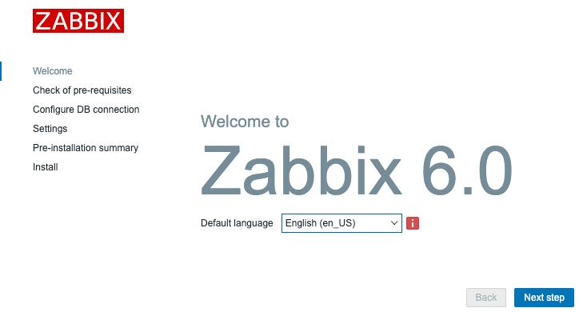

Рисунок 1.9 - Окно начальной конфигурации Zabbix

11. Нажмите на **Следующий шаг** дважды, пока не появится следующая страница:

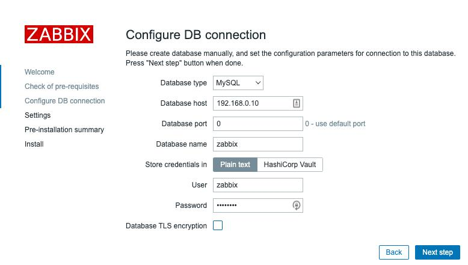

Рисунок 1.10 - Окно конфигурации базы данных Zabbix для lar-book-ha1

12. Убедитесь, что в поле **Database host** указан IP-адрес нашей базы данных Zabbix MariaDB (`192.168.0.10`). 	Затем введите пароль базы данных для нашего пользователя базы данных **zabbix**.

13. Затем, для последнего шага, для нашего первого узла установите **Zabbix server name** как `lar-book-ha1` и выберите часовой пояс, как показано на следующем снимке экрана.

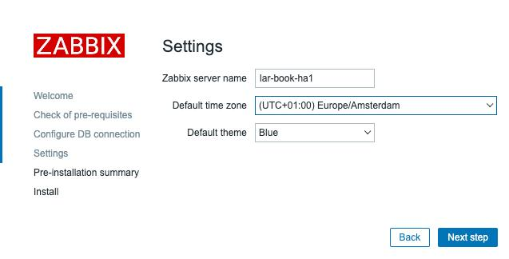

Рисунок 1.11 - Окно настроек сервера Zabbix для lar-book-ha1

14. Затем нажмите **Следующий шаг** и **Finish**.

15. Теперь нам нужно сделать то же самое со вторым фронтендом. Войдите в `lar-book-ha1` и выполните следующие действия.

В системах на базе RHEL:

```
systemctl stop httpd
```

Для систем Ubuntu:

```
systemctl stop apache2
```

16. Перейдя на свой виртуальный IP (в примере IP `http://192.168.0.5/zabbix`), вы снова увидите тот же мастер настройки.

17. Снова заполните данные базы данных:

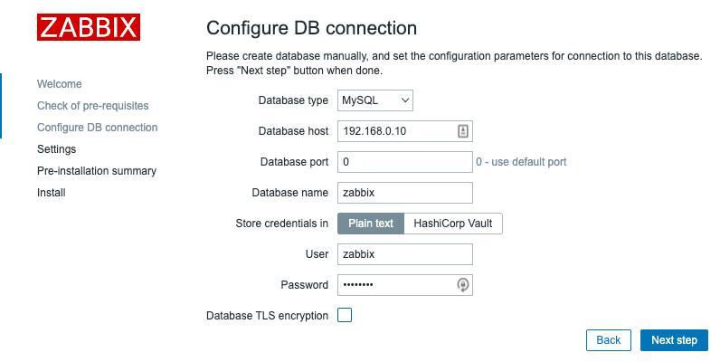

Рисунок 1.12 - Окно конфигурации базы данных Zabbix для lar-book-ha2

18. Затем обязательно установите **Zabbix server name** как `lar-book-ha2`, как показано на скриншоте.

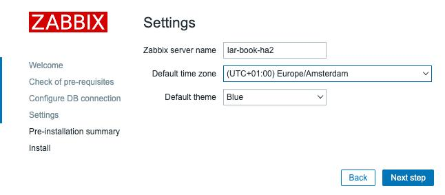

Рисунок 1.13 - Окно настроек сервера Zabbix для lar-book-ha2

19. Теперь нам нужно снова включить фронтенд `lar-book-ha1`, выполнив следующие действия. В системах на базе RHEL:

```
systemctl start httpd
```

Для систем Ubuntu:

```
systemctl start apache2
```

Это должен быть наш последний шаг. Теперь все должно работать как ожидалось. Обязательно проверьте файл журнала вашего сервера Zabbix, чтобы убедиться, что узлы HA работают так, как ожидалось.

### Как это работает...

Теперь, когда мы сделали это, как на самом деле работает сервер Zabbix в режиме высокой доступности? Давайте начнем с проверки страницы ** Reports | System information** (**Отчеты** | **Информация о системе**) в нашем фронтенде Zabbix.

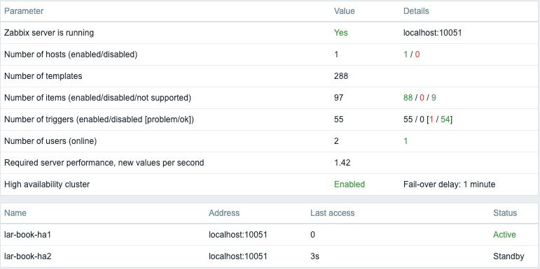

Рисунок 1.14 - Системная информация сервера Zabbix с информацией о HA

Теперь мы видим, что у нас появилась новая информация. Например, параметр **High availability cluster** (**Кластер высокой доступности**). Этот параметр теперь говорит нам, включена ли высокая доступность или нет, а также какова задержка при переходе к отказу. В нашем случае это 1 минута, что означает, что может пройти до 1 минуты, прежде чем будет инициировано аварийное завершение.

Кроме того, мы можем видеть каждый узел в нашем кластере. Поскольку Zabbix теперь поддерживает от одного до многих узлов в кластере, мы можем видеть каждый из них, участвующий в нашем кластере, прямо здесь. Давайте посмотрим на созданную нами конфигурацию:

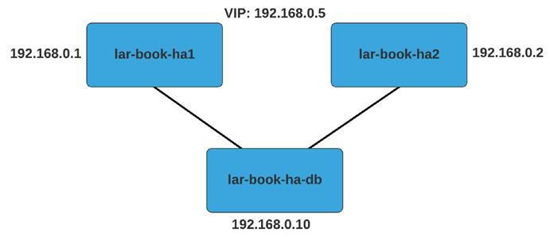

Рисунок 1.15 - Настройка HA сервера Zabbix

Как вы можете видеть в настройке, мы подключили наши два узла сервера Zabbix **lar-book-ha1** и **lar-book-ha2** к нашей единой базе данных Zabbix **lar-book-ha-db**. Поскольку наша база данных Zabbix является единым источником истины, ее можно использовать и для хранения конфигурации нашего кластера. В конечном итоге, все, что делает Zabbix, всегда хранится в базе данных, от конфигурации хоста до исторических данных и информации о высокой доступности. Вот почему создание кластера Zabbix - это простое дело: достаточно указать `HANodeName` в файле конфигурации сервера Zabbix.

Мы также включили параметр `NodeAddress` в конфигурационный файл. Этот параметр используется фронтендом Zabbix, чтобы убедиться, что наша системная информация (виджет) и сервер Zabbix не выполняют работу по уведомлению фронтенда. Параметр `NodeAddress` укажет фронтенду, к какому IP-адресу подключаться для каждого соответствующего сервера, когда он станет активным сервером Zabbix.

Чтобы продвинуться немного дальше, я добавил простую установку keepalived в эту установку. Keepalived - это способ создания простых отказоустойчивых настроек VRRP между серверами Linux. В нашем случае мы ввели VIP в качестве `192.168.0.5` и добавили мониторинг процесса `chk_apache_httpd`, чтобы определить время аварийного переключения. Наше аварийное переключение работает следующим образом:

```
lar-book-ha1 имеет приоритет 244

lar-book-ha2 имеет приоритет 243
```

Если на нашем узле запущен HTTPd или Apache 2, это добавляет вес 10 к нашему приоритету, что приводит к общему приоритету `254` и `253`, соответственно. Теперь представим, что на `lar-book-ha1` больше не запущен процесс веб-сервера. Это означает, что его приоритет падает до `244`, что ниже, чем `253` на `lar-book-ha2`, на котором процесс веб-сервера запущен.

Узел с наивысшим приоритетом будет иметь VIP `192.168.0.5`, что означает, что на этом узле запущен фронтенд Zabbix, который будет обслуживаться.

Комбинируя эти два способа настройки высокой доступности, мы только что создали избыточность для двух частей, составляющих нашу установку Zabbix, что позволяет нам свести перебои к минимуму.

### Это еще не все...

Теперь вы можете задаться вопросом, а что если я захочу пойти дальше в плане настройки высокой доступности. Во-первых, функция высокой доступности Zabbix построена так, чтобы быть простой и понятной для всей базы пользователей Zabbix. Это означает, что на данный момент вы можете не увидеть того количества функций, которое вы могли бы получить при использовании сторонней реализации.

Тем не менее, новая функция высокой доступности сервера Zabbix оказалась долгожданной функцией, которая действительно что-то добавляет. Если вы хотите запустить такую установку высокой доступности, то лучшим способом добавить еще один уровень сложности к высокой доступности будет установка MySQL master/master. Настройка базы данных Zabbix с высокой доступностью, которая является основным источником истины, позволит убедиться, что ваша установка Zabbix действительно надежна во всех возможных отношениях. Для получения дополнительной информации о репликации в MariaDB ознакомьтесь с документацией здесь: [https://mariadb.com/kb/en/standard-replication/](https://mariadb.com/kb/en/standard-replication/).

## Использование фронтенда Zabbix

Если вы впервые используете Zabbix, поздравляем вас с тем, что вы добрались до пользовательского интерфейса. Если вы возвращаетесь к использованию Zabbix, то в пользовательском интерфейсе Zabbix 6 произошли некоторые изменения, которые вы можете заметить. Мы рассмотрим некоторые из различных элементов, которые можно найти во фронтенде Zabbix, чтобы во время работы над этой книгой вы чувствовали себя уверенно и могли найти все, что вам нужно.

### Готовимся

Чтобы начать работу с пользовательским интерфейсом Zabbix, все, что нам нужно сделать, это войти во фронтенд. На IP-адресе вашего сервера, на котором запущен фронтенд Zabbix, будет открыта следующая страница:

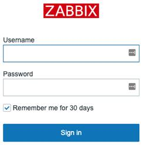

Рисунок 1.16 - Экран входа в систему Zabbix

Убедитесь, что вы вошли во фронтенд Zabbix с учетными данными по умолчанию:

* **Username:** `Admin`

* **Password:** `zabbix`.

<table border="1" width="100%" cellpadding="5">
  <tr>
    <td>
    <p><b>Совет</b></p>
<p>Как и в Linux, Zabbix в большинстве случаев чувствителен к регистру. При вводе имени пользователя убедитесь, что вы вводите правильные регистры; в противном случае вы не сможете войти в систему!</p>
</td>
</tr>
</table>

### Как это сделать...

После того как вы войдете в систему, вам откроется страница по умолчанию, которая является приборной панелью по умолчанию. Это то, что в Zabbix называется **Global view** (**Глобальный вид**), и он дает нам хороший обзор происходящего. Мы можем полностью настроить эту и все другие приборные панели, которые предоставляет Zabbix, но это хорошая идея - ознакомиться с настройками по умолчанию, прежде чем создавать что-то новое:


Рисунок 1.17 - Приборная панель глобального представления

Итак, давайте начнем знакомство с фронтендом Zabbix 6 с рассмотрения панели по умолчанию. Пожалуйста, следуйте за фронтендом, нажимая и проверяя упомянутые материалы.

В Zabbix используются приборные панели, которые заполнены виджетами для отображения информации. Давайте рассмотрим различные виджеты в стандартной приборной панели и подробно опишем их.

Начнем слева направо с виджета **System information** (**Системная информация**):

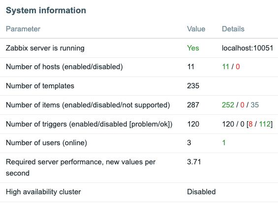

Рисунок 1.18 - Виджет "Информация о системе"

Это виджет **System information** (**Информация о системе**), который, как вы уже догадались, содержит подробную информацию о системе. Таким образом, мы можем следить за тем, что происходит с нашим сервером Zabbix, и узнать, запущен ли вообще наш Zabbix. Давайте пройдемся по параметрам:

* **Zabbix server is running:** Сообщает нам, запущен ли бэкэнд сервера Zabbix и где он запущен. В данном случае он запущен, и запущен на `localhost:10051`.

* **Number of hosts** (**Количество хостов**): Здесь указывается количество хостов **включенных** (11), количество хостов **отключенных** (0) и количество **шаблонов**, которые у нас есть (235). Это дает нам быстрый обзор информации о хостах нашего сервера Zabbix.

* **Number of items** (**Количество элементов**): Здесь мы можем увидеть подробную информацию об элементах нашего сервера Zabbix - в данном случае **включено** (287), **отключено** (0) и **не поддерживается** (35).

* **Number of triggers** (**Количество триггеров**): Здесь указывается количество триггеров. Мы видим, сколько из них **включено** (120) и **отключено** (0), а также сколько находится в состоянии **проблема** (8) и сколько в состоянии **ок** (112).

* **Number of users (online)** (**Количество пользователей (онлайн))**: Первое значение показывает общее количество пользователей. Второе значение показывает количество пользователей, которые в настоящее время вошли во фронтенд Zabbix.

* **Required server performance, new values per second** (**Требуемая производительность сервера, новых значений в секунду**): 	Возможно, я познакомлю вас с совершенно новым понятием - **Новые значения в секунду**, или **NVPS**. 	Сервер получает или запрашивает значения через элементы и записывает их в нашу базу данных MariaDB (или другую базу данных). Информация NVPS, представленная здесь, показывает примерное количество NVPS, полученных сервером Zabbix. Следите за этим по мере роста вашего сервера Zabbix, так как это хороший индикатор для того, чтобы понять, как быстро вам следует масштабироваться.

* **High availability cluster** (**Кластер высокой доступности**): 	Если вы используете кластер высокой доступности сервера Zabbix, здесь вы увидите, включен ли он, и какова задержка переключения. 	Кроме того, на странице **Информация о системе** будет отображаться дополнительная информация о высокой доступности.

Вы также можете увидеть здесь три дополнительных значения в зависимости от вашей установки:

* **Database history tables upgraded** (**Обновление таблиц истории базы данных**): Если вы видите это, это означает, что одна из таблиц истории вашей базы данных еще не обновлена. Числовые (плавающие) таблицы были расширены, чтобы позволить сохранять больше символов в каждой таблице данных.

* **Database history tables upgraded** (**Таблицы истории базы данных обновлены**): Если вы видите это, это означает, что одна из таблиц истории вашей базы данных еще не обновлена. Числовые (плавающие) таблицы были расширены, чтобы позволить сохранять больше символов для каждой точки данных. Эта таблица не обновляется автоматически при переходе с Zabbix 4 на 5 или выше, так как она нужна не всем, и обновление может занять много времени.

* **Database name** (**Имя базы данных**): Если вы видите имя вашей базы данных со значением вашей версии, это может указывать на то, что вы используете неподдерживаемую версию базы данных. Вы можете увидеть сообщение типа: `Warning! Unsupported <DATABASE NAME> database server version. Should be at least <DATABASE VERSION>`

Итак, это один из самых важных виджетов, когда речь идет о вашем сервере Zabbix, и, как по мне, его стоит держать на главной приборной панели.

Давайте перейдем к следующему виджету, **Host availability** (**Доступность хоста**):

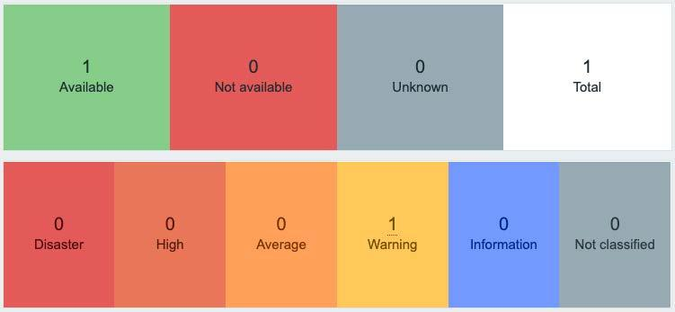

Рисунок 1.19 - Виджет доступности хоста

Виджет **Доступность хоста** - это виджет быстрого обзора, показывающий все, что вы хотите знать о статусе доступности контролируемого хоста. В этом виджете показано, является ли хост **Доступным**, **Недоступным** или **Неизвестным**. Таким образом, вы получаете хороший обзор доступности всех хостов, которые вы можете отслеживать с помощью своего сервера Zabbix, в одном виджете.

Кроме того, он также показывает, на скольких узлах в данный момент срабатывает триггер в определенном состоянии. В Zabbix есть несколько состояний по умолчанию:

* **Disaster**

* **High**

* **Average**

* **Warning**

* **Information**

* **Not classified**

Мы можем полностью настроить уровни серьезности и цвета; например, какие уровни серьезности мы хотим поставить на те или иные триггеры. Так что, если вас сейчас беспокоят уровни серьезности, не стоит; мы вернемся к этому позже.

**Совет**.

Настройка уровней серьезности и цветов может быть очень полезна для вашей организации. Мы можем настроить уровни серьезности в соответствии с уровнями, используемыми в нашей компании, или даже в соответствии с некоторыми другими используемыми нами системами мониторинга.

Следующий виджет - **Local**:


Рисунок 1.20 - Виджет Local, указывающий время

Это часы с локальным системным временем Linux. Нужно ли говорить больше? Давайте перейдем к

виджету **Problems**:

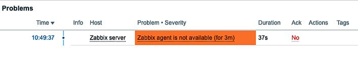

Рисунок 1.21 - Один из доступных виджетов Проблемы

Вот это интересный виджет, который я часто использую. На этом экране мы видим наши текущие проблемы, так что если мы правильно настроили наши триггеры, мы получаем здесь ценную информацию. Быстрый обзор того, сколько узлов испытывают проблемы - это одно, но страница **Problems** также дает нам более подробную информацию о проблеме:

* **Время**: В какое время эта проблема была впервые замечена сервером Zabbix.

* **Info**: Информация о событии, здесь представлены статусы Manual close и Suppressed.

* **Хост**: На каком хосте возникла проблема.

* **Problem**/**Severity**: В чем заключается проблема и насколько она серьезна. Серьезность показана цветом, в данном случае оранжевый означает **Средняя**.

* **Длительность**: Как долго существует проблема.

* **Ack**: Была ли эта проблема подтверждена или нет вами или другим пользователем Zabbix.

* **Действия**: Какие действия были предприняты после возникновения этой проблемы, например, пользовательский сценарий, выполняемый при создании проблемы. Если навести курсор на любое действие, будет показана подробная информация обо всех действиях, которые были предприняты для этой проблемы.

* **Тэги**: Какие теги присвоены данной проблеме.

Виджет **Проблемы** очень полезен. У нас есть разные типы этого виджета, и, как уже упоминалось, он полностью настраивается, основываясь на том, как этот виджет показывает нам наши проблемы. Взгляните на некоторые из вариантов, которые мы подробно рассмотрим в следующей главе:

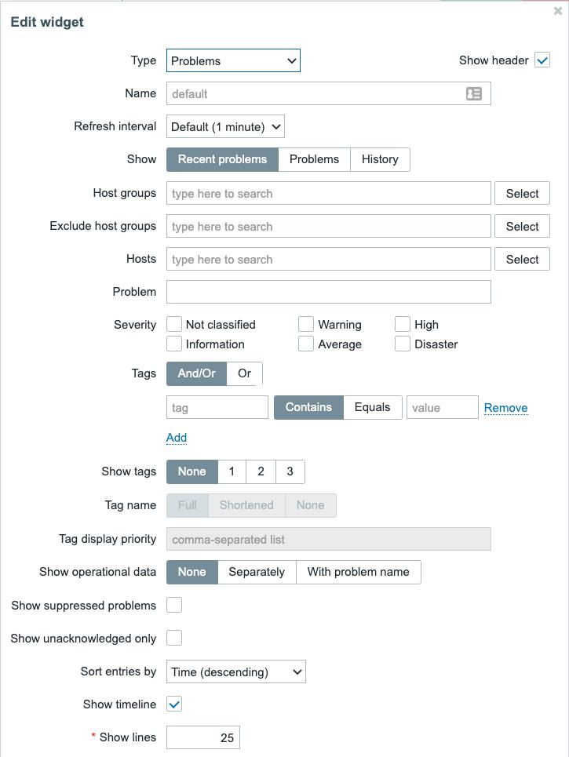

Рисунок 1.22 - Экран виджета "Редактирование"


**Совет**

Мы можем скрыть уровни серьезности в этих виджетах, чтобы убедиться, что мы видим только важные проблемы. Иногда мы не хотим видеть на приборных панелях проблемы информационной серьезности; это может отвлечь вас от более важной проблемы. Сохраняйте чистоту приборных панелей, настроив виджет в полной мере.

Теперь есть еще два виджета, которые совершенно пусты на нашей приборной панели по умолчанию. Это виджеты **Излюбленные карты** и **Излюбленные графики**. Эти виджеты можно заполнить быстрыми ссылками на ваши любимые карты и графики, соответственно, что даст вам быстрый доступ к ним, не переходя по меню:


Рисунок 1.23 - Избранные виджеты

Теперь мы знаем, как работать с фронтендом Zabbix, и можем продолжить работу над навигацией по нашему экземпляру.

## Навигация по фронтенду

Навигация по фронтенду Zabbix проще, чем кажется на первый взгляд, особенно с учетом некоторых удивительных изменений, внесенных в пользовательский интерфейс, начиная с Zabbix 5.0. Давайте в этом рецепте подробнее изучим пользовательский интерфейс Zabbix, рассмотрев панель навигации и то, что она может предложить.

### Готовимся

Теперь, когда мы увидели первую страницу после входа в систему с помощью стандартной приборной панели, пришло время начать навигацию по пользовательскому интерфейсу Zabbix и посмотреть некоторые другие доступные страницы. Мы будем перемещаться по боковой панели и изучать страницы, доступные в нашей установке Zabbix, чтобы, когда мы начнем мониторинг наших сетей и приложений, мы знали, где мы можем все найти.

Итак, прежде чем продолжить, убедитесь, что у вас готов сервер Zabbix, как было установлено в предыдущих рецептах.

### Как это делается...

Панель навигации Zabbix - это вход во все наши мощные инструменты и параметры конфигурации. Zabbix использует левостороннюю панель навигации, чтобы сохранить наш пользовательский интерфейс как можно более чистым. Кроме того, они сделали боковую панель исчезающей, чтобы мы могли внимательно просматривать все содержимое, без боковой панели, которая загораживает нам обзор.

**Совет**

Мы не можем изменить расположение навигационного меню Zabbix, но его можно скрыть в меньшем виде или полностью спрятать. Если вы хотите, чтобы навигационная панель скрывалась (или не скрывалась), нажмите на первый значок справа от логотипа Zabbix. Если вы хотите полностью скрыть панель навигации, нажмите на второй значок справа от логотипа Zabbix.

Давайте посмотрим на боковую панель Zabbix, как мы видим ее на странице по умолчанию, и познакомимся с ней поближе. Пожалуйста, следите за развитием событий во фронтенде, нажимая и проверяя упомянутый контент:

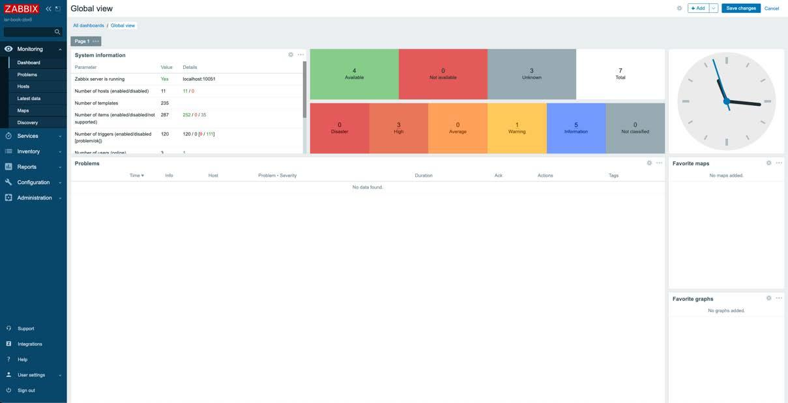

Рисунок 1.24 - Страница Zabbix по умолчанию, как она выглядит в вашем собственном веб-браузере

Здесь у нас есть несколько категорий на выбор, а на один уровень ниже категорий находятся различные страницы. Во-первых, давайте начнем с подробного описания категорий:

* **Мониторинг**: Категория **Мониторинг** - это место, где мы можем найти всю информацию о собранных нами данных. По сути, это категория, которую вы хотите использовать при работе с Zabbix для чтения любой собранной информации, над получением которой вы упорно трудились.

* **Услуги**: Категория **Услуги** является новой для Zabbix 6 и входит в состав улучшенных функций мониторинга бизнес-сервисов. Здесь мы можем найти всю информацию, касающуюся мониторинга услуг и SLA.

* **Инвентарь**: Категория **Инвентарь** - это классная дополнительная функция в Zabbix, которую мы можем использовать для просмотра информации об инвентаризации хостов. Вы можете добавить такие вещи, как версии программного обеспечения или серийные номера хостов и просмотреть их здесь.

* **Отчеты**: 	Категория **Отчеты** содержит множество предопределенных и настраиваемых пользователем отчетов, ориентированных на отображение обзора таких параметров, как системная информация, триггеры и собранные данные.

* **Конфигурация**: 	Категория **Конфигурация** - это место, где мы создаем все, что хотим видеть в **Мониторинге**, **Инвентаризации** и **Отчетах**. 	Мы можем редактировать наши настройки в соответствии с нашими потребностями, чтобы Zabbix мог показать нам эти данные в полезном виде.

* **Администрирование**: 	В категории **Администрирование** мы управляем сервером Zabbix. Здесь вы найдете все настройки сервера, чтобы вы и ваши коллеги могли хорошо работать с Zabbix.

Вы будете довольно часто обращаться ко всем этим параметрам во время работы с этой книгой, поэтому запомните их хорошо. Давайте немного углубимся в эти категории, рассматривая их по очереди. Начнем с категории **Мониторинг**:

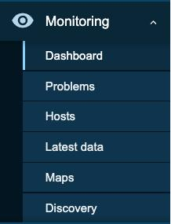

Рисунок 1.25 - Раздел "Мониторинг" боковой панели


Вкладка **Мониторинг** содержит следующие страницы:

* **Панель**: Здесь находится приборная панель по умолчанию, которую мы показывали в *Рисунок 1.24*. Здесь же мы можем добавить множество других панелей для всего, что только можно придумать.

* **Проблемы**: Здесь мы можем подробно рассмотреть нашу текущую проблему. При необходимости нам предоставляется множество опций фильтрации для сужения поиска проблемы.

* **Хосты**: **Хосты** предоставляет быстрый обзор того, что происходит с хостами. Он также предоставляет ссылки для перехода на страницы с данными по нашим хостам.

* **Последние данные**: Это страница, которую мы будем использовать довольно часто на протяжении всей нашей профессиональной жизни в Zabbix. На странице **Последние данные** мы можем найти собранные значения для каждого отдельного хоста, которые, конечно же, можно фильтровать.

* **Карты**: Карты - очень полезный инструмент в Zabbix для получения общего представления о вашей инфраструктуре. Мы можем использовать их для обзора сети и т.д.

* **Обнаружение**: Эта страница предоставляет нам обзор обнаруженных устройств. Мы поработаем над этим позже.

Далее у нас есть категория **Услуги**:

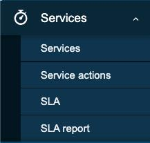

Рисунок 1.26 - Раздел "Услуги" боковой панели

Эта часть боковой панели содержит следующие страницы:

* **Услуги**: Здесь мы размещаем все наши службы, которые мы хотим отслеживать.

* **Действия служб**: Раздел, где мы можем настроить любые действия для наших подключенных служб. Здесь вы найдете такие опции, как отправка уведомлений о SLA и многое другое.

* **SLA**: Здесь мы можем установить любые SLA, которые затем сможем использовать в наших услугах.

* **Отчет SLA**: Подробный обзор подключенных услуг с их SLA и информацией о том, выполняются они или нет.

Далее, у нас есть категория **Инвентарь**:

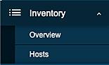

Рисунок 1.27 - Раздел инвентаризации боковой панели

Вкладка **Инвентарь** содержит следующие страницы:

* **Обзор**: Страница быстрого обзора информации о вашем инвентаре.

* **Хосты**: Более подробный обзор инвентаризационных данных по каждому хосту.

Далее, у нас есть категория **Отчеты**:

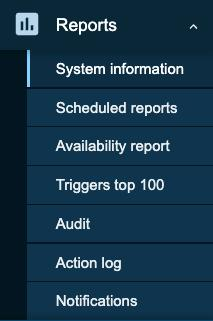

Рисунок 1.28 - Раздел "Отчеты" боковой панели

Вкладка **Отчеты** содержит следующие страницы:

* **Системная информация**: Здесь вы можете просмотреть информацию о системе; она содержит ту же информацию, что и виджет **Информация о системе**.

* **Запланированные отчеты**: Это место, где мы создаем автоматические отчеты в формате PDF, которые мы хотим рассылать.

* **Отчет о наличии**: На этой странице мы можем увидеть процент времени, в течение которого триггер находился в состоянии **проблема** по сравнению с состоянием **ок**. Это полезный способ увидеть, как долго определенные элементы действительно здоровы.

* **Триггеры топ-100**: 100 лучших триггеров, которые наиболее часто меняли свое состояние в течение определенного периода времени.

* **Аудит**: Здесь мы можем посмотреть, кто и что изменил на нашем сервере Zabbix. Это отличный способ узнать, кто из коллег заблокировал вас случайно или это было сделано специально.

* **Журнал действий**: Мы можем просмотреть список действий, которые были предприняты, например, из-за того, что триггеры перешли в состояние **проблема** или **ок**.

* **Уведомления**: На этой странице мы можем увидеть количество уведомлений, отправленных нашим пользователям.

Далее у нас есть категория **Конфигурация**:

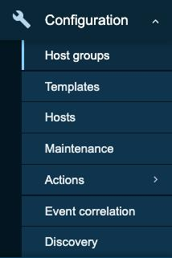

Рисунок 1.29 - Раздел Конфигурация боковой панели

Вкладка **Конфигурация** содержит следующие страницы:

* **Группы хостов**: Здесь мы создаем группы хостов, например, группу для всех *Linux-серверов*.

* **Шаблоны**: Здесь мы создаем шаблоны, которые мы можем использовать для мониторинга хостов с сервера Zabbix.

* **Хосты**: Еще одна вкладка hosts, но на этот раз она не предназначена для проверки данных. Это место, где мы добавляем и конРисунок настройки хостов.

* **Maintenance**: В Zabbix есть возможность устанавливать периоды обслуживания; таким образом, триггеры или уведомления не будут беспокоить вас, когда вы, например, убираете что-то из сети для обслуживания.

* **Действия**: Помните, я упоминал, что мы можем назначать действия для триггеров при изменении их состояния? Здесь мы создаем эти действия.

* **Корреляция событий**: Здесь мы можем соотнести проблемы, чтобы уменьшить шум или предотвратить бурю событий. Это достигается путем закрытия новых или старых проблем, когда они коррелируют с другими проблемами.

* **Обнаружение**: Здесь мы подключаем Zabbix discovery для автоматического создания хостов.

Наконец, у нас есть категория **Администрирование**:

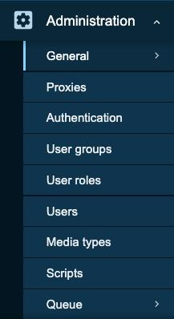

Рисунок 1.30 - Раздел администрирования боковой панели

Вкладка **Администрирование** содержит следующие страницы:

* **Общие**: Общая страница содержит конфигурацию нашего сервера Zabbix. Здесь можно найти различные настройки, начиная от housekeeper и заканчивая темой фронтенда.

* **Прокси**: Здесь мы настраиваем прокси-серверы, которые должны быть подключены к этому серверу Zabbix.

* **Аутентификация**: Здесь мы можем найти настройки аутентификации, такие как LDAP, SAML и HTTP.

* **Группы пользователей**: Здесь мы создаем группы пользователей и разрешения для этих групп.

* **Роли пользователей**: Здесь можно задать роли различных пользователей, чтобы ограничить или расширить определенные функции фронтенда для определенных пользователей.

* **Пользователи**: Добавление пользователей на эту страницу.

* **Типы медиа**: В Zabbix предустановлено несколько типов медиа, которые вы найдете здесь. Мы также можем добавить пользовательские типы медиа.

* **Сценарии**: Здесь мы можем добавить пользовательские сценарии для расширения функциональности Zabbix во фронтенде.

* **Очередь**: Здесь можно просмотреть очередь сервера Zabbix. Элементы могут застрять в очереди из-за сбора данных или проблем с производительностью.

**Совет**.

При использовании аутентификации Zabbix, такой как HTTP, LDAP или SAML, нам все равно необходимо создать внутренних пользователей с нужными правами. Создайте пользователей, чтобы имя пользователя в Zabbix соответствовало имени пользователя вашего метода аутентификации, и используйте метод аутентификации для управления паролями. Следите за следующим кейсом Zabbix, чтобы узнать о ходе реализации или оставить свой голос:

https://support.zabbix.com/browse/ZBXNEXT-276
