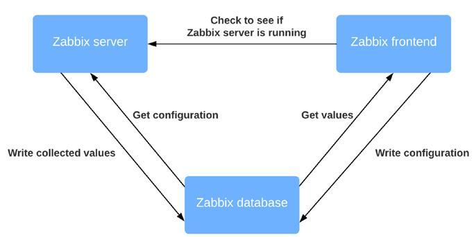
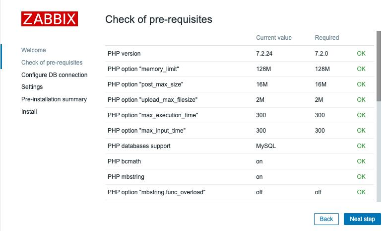
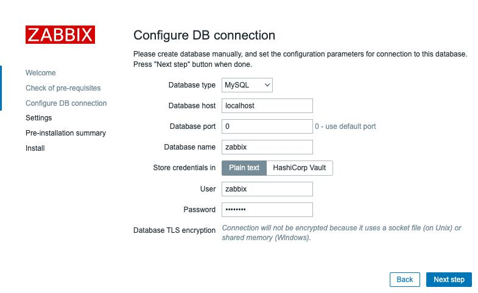
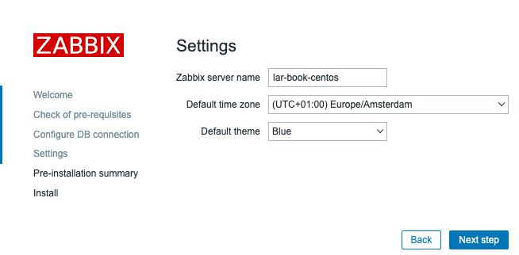
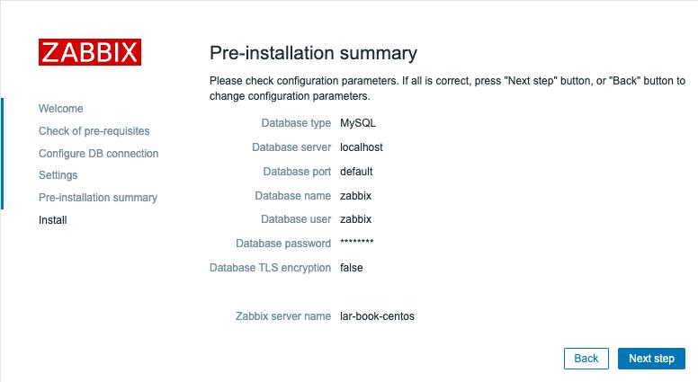
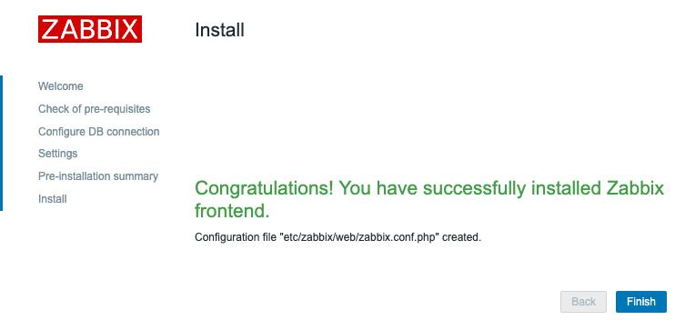
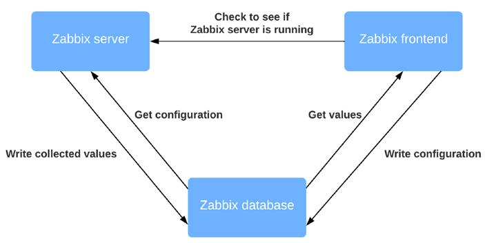

# Установка Zabbix и начало работы с использованием фронтенда

Zabbix 6 является продолжением Zabbix 5, поскольку на этот раз мы не видим больших изменений в пользовательском интерфейсе. Тем не менее, в Zabbix 6 вы найдете множество улучшений, как в пользовательском интерфейсе, так и в основных компонентах. Например, введение высокой доступности для сервера Zabbix. Мы подробно опишем все важные изменения на протяжении всей книги.

В этой главе мы установим сервер Zabbix и изучим пользовательский интерфейс Zabbix, чтобы познакомить вас с ним. Мы рассмотрим поиск хостов, триггеров, приборных панелей и многое другое, чтобы вы чувствовали себя уверенно, погружаясь глубже в материал в этой книги. Пользовательский интерфейс Zabbix имеет множество возможностей для изучения, поэтому, если вы только начинаете, не расстраивайтесь. Он достаточно структурно построен, и как только вы освоитесь, я уверен, что вы без проблем найдете свой путь. Вы узнаете все об этих темах в следующих рецептах:

* Установка сервера Zabbix

* Настройка фронтенда Zabbix

* Включение высокой доступности сервера Zabbix
* Использование фронтенда Zabbix
* Навигация по фронтенду Zabbix

## Технические требования

Мы начнем эту главу с пустой Linux (виртуальной) машины. Не стесняйтесь выбрать дистрибутив Linux на базе RHEL или Debian. Затем мы настроим сервер Zabbix с нуля на этом хосте.

Поэтому, прежде чем приступить к работе, убедитесь, что у вас есть готовый Linux-хост.

## Установка сервера Zabbix

Прежде чем что-либо делать в Zabbix, нам необходимо установить его и подготовиться к работе с ним. В этом рецепте мы узнаем, как установить Zabbix server 6.

### Подготовка

Прежде, чем мы установим сервер Zabbix, нам нужно будет выполнить некоторые предварительные требования. В этой книге мы будем использовать в основном **MariaDB**. MariaDB популярна, и имеется много информации по ее использованию с Zabbix.

На данный момент перед вами должен быть подготовленный Linux-сервер под управлением дистрибутива на базе RHEL или Debian. Я буду устанавливать на свой сервер CentOS и Ubuntu 20.04; назовем их `lar-book-centos` и `lar-book-ubuntu`.

Когда вы подготовите свой сервер, мы можем начать процесс установки.

### Как это сделать...

1. Начнем с добавления репозитория Zabbix 6.0 в нашу систему.

    Для систем на основе RHEL:

`````
rpm -Uvh https://repo.zabbix.com/zabbix/6.0/rhel/8/
x86_64/zabbix-release-6.0-1.el8.noarch.rpm

dnf clean all
`````

    Для систем Ubuntu:

```
wget https://repo.zabbix.com/zabbix/6.0/ubuntu/pool/
main/z/zabbix-release/zabbix-release_6.0-1+ubuntu20.04_ all.deb

dpkg -i zabbix-release_6.0-1+ubuntu20.04_all.deb
apt update
```

2. Теперь, когда репозиторий добавлен, давайте добавим репозиторий MariaDB на наш сервер:

```
wget https://downloads.mariadb.com/MariaDB/mariadb_repo_setup
chmod +x mariadb_repo_setup
./mariadb_repo_setup
```

3. Затем установите и включите его с помощью следующих команд:

    Для систем на базе RHEL:

```
dnf install mariadb-server
systemctl enable mariadb
systemctl start mariadb
```

    Для систем Ubuntu:

```
apt install mariadb-server
systemctl enable mariadb
systemctl start mariadb
```

4. После установки MariaDB убедитесь, что ваша установка защищена, выполнив следующую команду:

`/usr/bin/mariadb-secure-installation`

5. Обязательно отвечайте на вопросы "Yes" (Y) и настройте надежный пароль root.

6. Выполните настройку безопасной установки и обязательно сохраните где-нибудь свой пароль. Настоятельно рекомендуется использовать хранилище паролей.

7. Теперь давайте установим наш сервер Zabbix с поддержкой MySQL. Для систем на базе RHEL:

`dnf install zabbix-server-mysql zabbix-sql-scripts`

Для Ubuntu систем:

`apt install zabbix-server-mysql zabbix-sql-scripts`

8. После установки сервера Zabbix мы готовы к созданию базы данных Zabbix. Войдите в MariaDB со следующими параметрами:

`mysql -u root -p`

9. Введите пароль, который вы установили во время безопасной установки, и создайте базу данных Zabbix с помощью следующих команд. Не забудьте изменить `password` во второй команде:

```
create database zabbix character set utf8mb4 collate utf8mb4_bin;
create user zabbix@localhost identified by 'password';
grant all privileges on zabbix.\* to zabbix@localhost identified by 'password';
flush privileges;
quit
```

<table border="1" width="100%" cellpadding="5">
  <tr>
    <td>
    <p><b>Подсказка</b></p>
<p>Для тех, кому это может понадобиться, Zabbix теперь также поддерживает <code>utf8mb4</code>. Мы изменили <code>utf8</code> на <code>utf8mb4</code> в приведенной выше команде, и все будет работать. Для справки проверьте тикет поддержки Zabbix здесь: <a href="https://support.zabbix.com/browse/ZBXNEXT-3706">https://support.zabbix.com/browse/ZBXNEXT-3706</a>.</p>
    </td>
  </tr>
</table>

10. Теперь нам нужно импортировать нашу схему базы данных Zabbix в нашу вновь созданную базу данных Zabbix:

```
zcat /usr/share/doc/zabbix-sql-scripts/mysql/server.sql.gz | mysql -u zabbix -p zabbix
```

<table border="1" width="100%" cellpadding="5">
  <tr>
    <td>
    <p><b>Важное замечание</b></p>
<p>На этом этапе может показаться, что вы застряли и система не отвечает. Однако не волнуйтесь, поскольку импорт схемы SQL займет некоторое время.</p>
    </td>
  </tr>
</table>

Теперь мы закончили подготовку нашей стороны MariaDB и готовы перейти к следующему шагу - настройке сервера Zabbix:

1. Сервер Zabbix настраивается с помощью файла конфигурации сервера Zabbix. Этот файл находится в каталоге `/etc/zabbix/`. Давайте откроем этот файл с помощью нашего любимого редактора; я буду использовать Vim на протяжении всей книги:

```
vim /etc/zabbix/zabbix_server.conf
```

2. Теперь убедитесь, что следующие строки в файле соответствуют имени вашей базы данных, имени пользователя базы данных и паролю пользователя базы данных:

```
DBName=zabbix
DBUser=zabbix
DBPassword=password
```

<table border="1" width="100%" cellpadding="5">
  <tr>
    <td>
    <p><b>Подсказка</b></p>
<p>Перед запуском сервера Zabbix необходимо настроить SELinux или AppArmor, чтобы разрешить использование сервера Zabbix. Если это тестовая машина, вы можете использовать разрешающую позицию для SELinux или отключить AppArmor, но рекомендуется не делать этого в производстве.</p>
</td>
</tr>
</table>

3.	Все готово; теперь мы готовы запустить наш сервер Zabbix:

```
systemctl enable zabbix-server
systemctl start zabbix-server
```

4. Проверьте, все ли запускается, как ожидалось, следующим образом: `systemctl status zabbix-server`.

5. В качестве альтернативы просмотрите файл журнала, в котором содержится подробное описание процесса запуска Zabbix:

```
tail -f /var/log/zabbix/zabbix_server.log
```

6. Большинство сообщений в этом файле в порядке, и их можно спокойно игнорировать, но обязательно хорошо прочитайте и посмотрите, нет ли проблем с запуском вашего сервера Zabbix.

### Как это работает...

Сервер Zabbix - это основной процесс нашей установки Zabbix. Он отвечает за мониторинг, оповещение о проблемах и многие другие задачи, описанные в этой книге. Полный стек Zabbix состоит как минимум из следующего:

* База данных (MySQL, PostgreSQL или Oracle)

* сервер Zabbix

* Apache или NGINX, на котором запущен фронтенд Zabbix с PHP 7.2+, но PHP 8 в настоящее время не поддерживается.

Мы можем увидеть компоненты и то, как они взаимодействуют друг с другом, на следующем рисунке:



Рисунок 1.1 - Диаграмма коммуникаций при настройке Zabbix

Мы только что настроили сервер Zabbix и базу данных; запустив их, мы практически готовы начать мониторинг. Сервер Zabbix взаимодействует с базой данных Zabbix для записи в нее собранных значений.

Однако остается одна проблема: мы не можем подключить наш сервер Zabbix к базе данных.

Для этого нам понадобится наш фронтенд Zabbix, который мы настроим в следующем рецепте.

## Настройка фронтенда Zabbix

Фронтенд Zabbix - это лицо нашего сервера. Это место, куда мы будем подключать все наши хосты, шаблоны, приборные панели, карты и все остальное. Без него мы были бы слепы к тому, что происходит на стороне сервера. Итак, давайте настроим наш фронтенд Zabbix в этом рецепте.

### Готовность

Мы собираемся настроить фронтенд Zabbix с помощью Apache. Прежде чем приступить к этому рецепту, убедитесь, что вы запустили сервер Zabbix на выбранном вами дистрибутиве Linux. В этих рецептах я буду использовать хосты `lar-book-centos` и `lar-book-ubuntu`, чтобы показать процесс настройки на CentOS 8 и Ubuntu 20.

### Как это сделать...

1. Давайте сразу же приступим к установке фронтенда. Для начала работы выполните следующую команду.

Для систем на базе RHEL:

```
dnf install zabbix-web-mysql zabbix-apache-conf
```

Для систем на базе Ubuntu:

```
apt install zabbix-frontend-php zabbix-apache-conf
```

<table border="1" width="100%" cellpadding="5">
  <tr>
    <td>
    <p><b>Подсказка</b></p>
<p>Не забудьте разрешить порты 80 и 443 в вашем брандмауэре, если вы его используете. Без этого вы не сможете подключиться к фронтенду.</p>
    </td>
  </tr>
</table>

2. Перезапустите компоненты Zabbix и убедитесь, что они запускаются при загрузке сервера, выполнив следующие действия.

Для систем на базе RHEL:

```
systemctl enable httpd php-fpm
systemctl restart zabbix-server httpd php-fpm
```

Для систем на базе Ubuntu:

```
systemctl enable apache2
systemctl restart zabbix-server apache2
```

3. Теперь мы должны быть в состоянии перейти к нашему фронтенду Zabbix без каких-либо проблем и начать последние шаги по настройке фронтенда Zabbix.

4. Откроем браузер и перейдем к IP-адресу нашего сервера. Он должен выглядеть следующим образом:

```
http://<ваш_сервер_ip>/zabbix
```

5.	Теперь мы должны увидеть следующую веб-страницу:


Рисунок 1.2 - Экран приветствия Zabbix

If you don't see this web page, it's possible you have missed some steps in the setup process. Retrace your steps and double-check your configuration files; even the smallest typo could prevent the web page from serving.

6. ​		Let's 	continue by clicking **Next 	step** 	on this page, which will serve you with the next page:



Рисунок 1.3 – The Zabbix installation pre-requisites page

7. ​	Every single option here should be showing **OK** now; if not, fix the mistake it's showing you. If everything is **OK**, you may proceed by clicking **Next step** again, which will take you to the next page:



Рисунок 1.4 – The Zabbix installation DB connection page

8. ​	Here, we need to tell our Zabbix frontend where our MySQL database is located. Since we installed it on **localhost**, we just need to make sure we issue the right database name, database user username, and database user password.

9. ​	This should make the Zabbix frontend able to communicate with the database. Let's proceed by clicking **Next step** again:



​Рисунок 1.5 – The Zabbix installation server details page

Next up is the Zabbix server configuration. Make sure to name your server something useful or something cool. For example, I've set up a production server called Meeseeks because every time we got an alert, we could make Zabbix say *"I'm Mr. Meeseeks look at me."* But something like zabbix.example.com also works.

10. ​		Let's 	name our server, set up the time zone to match our own time zone 	and proceed to the next step:



Рисунок 1.6 – The Zabbix installation summary page

11. Verify your settings and proceed to click **Next step** one more time.



Рисунок 1.7 – The Zabbix installation finish page

12. ​	You have successfully installed the Zabbix frontend. You may now click the **Finish** button and we can start using the frontend. You'll be served with a login page where you can use the following default credentials:

```
Username: Admin
Password: zabbix
```

**How it works…**

Now that we've installed our Zabbix frontend, our Zabbix setup is complete and we are ready to start working with it. Our Zabbix frontend will connect to our database to edit the configuration values of our setup, as we can see in the following Рисунок:



Рисунок 1.8 – Zabbix setup communications diagram

The Zabbix frontend will also talk to our Zabbix server, but this is just to make sure the Zabbix server is up and running. Now that we know how to set up the Zabbix frontend, we can start using it. Let's check this out after the next recipe.

**There's more...**

Zabbix provides a very convenient setup guide, which contains a lot of detail regarding the installation of Zabbix. I would always recommend keeping this page open during a Zabbix installation, as it contains information like the link to the latest repository. Check it out here:

https://www.zabbix.com/download

**Enabling Zabbix server high availability**

Zabbix 6 is here, with one of the most anticipated features of all time. High availability will bring your Zabbix setup to the next level by making sure that if one of your Zabbix servers is having issues, another one will take over.

A great thing about this implementation is that it supports an easy proprietary way to put one to many Zabbix servers in a cluster. A great way of making sure your monitoring stays in the air at all times (or at least as much as possible).

Now I do have to be honest, we cannot do anything like load balancing yet. But that is included on the Zabbix roadmap using the Zabbix proxies in a later version. Keep an eye out for any updates regarding that here:

https://www.zabbix.com/roadmap

**Getting ready**

Before getting started, please note that creating a high availability setup is considered an advanced topic. It might be more difficult than other recipes in this chapter.

For this setup, we will need three new virtual machines, as we are going to create a split Zabbix setup, unlike the setup that we created in the first recipe of this chapter. Let's take a look at how I have named our three new virtual machines and what their IP addresses will be:

1. lar-book-ha1 (192.168.0.1)

1. lar-book-ha2 (192.168.0.2)

1. lar-book-ha-db (192.168.0.10)

Two of these servers will run our Zabbix server cluster and a Zabbix frontend. The other server is just for our MySQL database. Please take note that the IP addresses used in the example may be different for you. Use the correct ones for your environment.

We will also need a virtual IP address for our cluster nodes. We will use 192.168.0.5 in the example.

**Tip**

In our setup, we are using only one MySQL Zabbix database. For making sure all parts of Zabbix are set up as highly available, it might be worth looking into setting up MySQL in a master/master setup. This would be a great combination with the Zabbix server's high availability.

This cookbook will NOT use SELinux or AppArmor, so make sure to disable those or add the correct policies before using this guide. Additionally, this guide also does not detail how to set up your firewall, so make sure to do this beforehand as well.

**How to do it…**

For your convenience, we've split this *How to do it…* section into three parts. One is setting up the database, the other is setting up the Zabbix server cluster, and the last is how to set up the Zabbix frontend redundantly. The *How it works…* section will then provide an explanation about the entire setup.

**Setting up the database**

Let's start with setting up our Zabbix database, ready to be used in a highly available

Zabbix server setup:

1. ​	Log in to lar-book-ha-db and install the MariaDB repository with the following command on RedHat based systems:

**wget https://downloads.mariadb.com/MariaDB/mariadb_repo_ setup**
**chmod +x mariadb_repo_setup**
**./mariadb_repo_setup**

2.	Then, let's install the MariaDB server application with the following command.

For RHEL-based systems:

**dnf install mariadb-server**
**systemctl enable mariadb**
**systemctl start mariadb**

For Ubuntu systems:

**apt install mariadb-server**
**systemctl enable mariadb**
**systemctl start mariadb**

1. ​	After installing MariaDB, make sure to secure your installation with the following command:

**/usr/bin/mariadb_secure_installation**

1. ​	Installing Zabbix and Getting Started Using the Frontend

1. 1. ​		Make 	sure to answer the questions with yes (Y) 	and conРисунок a root password that's secure. It's highly 	recommended to use a password vault for storing it.

1. 1. ​		Now 	let's create our Zabbix database for our Zabbix servers to connect 	to. Log in to MariaDB with the following command:

**mysql -u root -p**

1. ​	Enter the password you set up during the secure installation and create the Zabbix database with the following commands. Do not forget to change the password in the second, third, and fourth commands:

**create database zabbix character set utf8mb4 collate utf8mb4_bin;**
**create user zabbix@'192.168.0.1' identified by 'password';**
**create user zabbix@'192.168.0.2' identified by 'password';**
**create user zabbix@'192.168.0.5' identified by 'password';**
**grant all privileges on zabbix.\* to 'zabbix'@'192.168.0.1' identified by 'password';**
**grant all privileges on zabbix.\* to 'zabbix'@'192.168.0.2' identified by 'password';**
**grant all privileges on zabbix.\* to 'zabbix'@'192.168.0.5' identified by 'password';**
**flush privileges;**
**quit**

1. ​	Lastly, we need to import the initial Zabbix database configuration, but for that, we need to install the Zabbix repository.

For RHEL-based systems:

**rpm -Uvh https://repo.zabbix.com/zabbix/6.0/rhel/8/ x86_64/zabbix-release-6.0-1.el8.noarch.rpm**
**dnf clean all**

For Ubuntu systems:

**wget https://repo.zabbix.com/zabbix/6.0/ubuntu/pool/ main/z/zabbix-release/zabbix-release_6.0-1+ubuntu20.04_ all.deb**
**dpkg -i zabbix-release_6.0-1+ubuntu20.04_all.deb apt update**

1. ​	Then, we need to install the SQL scripts Zabbix module. For RHEL-based systems:

**dnf install zabbix-sql-scripts**

For Ubuntu systems:

**apt install zabbix-sql-scripts**

1. ​	Then, we issue the following command, which might take a while so be patient until it is done:

**zcat /usr/share/doc/zabbix-sql-scripts/mysql/server.sql. gz | mysql -uroot -p zabbix**
**Setting up the Zabbix server cluster nodes**

Setting up the cluster nodes works in the same way as setting up any new Zabbix server.

The only difference is that we will need to specify some new configuration parameters.

1. ​	Let's start by adding the Zabbix 6.0 repository to our systems lar-book-ha1 and lar-book-ha2:

**rpm -Uvh https://repo.zabbix.com/zabbix/6.0/rhel/8/ x86_64/zabbix-release-6.0-1.el8.noarch.rpm**
**dnf clean all**

For Ubuntu systems, use the following command:

**wget https://repo.zabbix.com/zabbix/6.0/ubuntu/pool/ main/z/zabbix-release/zabbix-release_6.0-1+ubuntu20.04_ all.deb**
**dpkg -i zabbix-release_6.0-1+ubuntu20.04_all.deb apt update**

1. ​	Now let's install the Zabbix server application with the following command. For RHEL-based systems:

**dnf install zabbix-server-mysql**

For Ubuntu systems:

**apt install zabbix-server-mysql**

1. ​	Installing Zabbix and Getting Started Using the Frontend

1. 1. ​		We 	will now edit the Zabbix server configuration files, starting with 	lar-book-ha1. 	Issue the following command:

**vim /etc/zabbix/zabbix_server.conf**

4.	Then, add the following lines to allow a database connection:

**DBHost=192.168.0.10**
**DBPassword=password**

1. To enable high availability on this host, add the following lines in the same file:

**HANodeName=lar-book-ha1**

1. ​	To make sure our Zabbix frontend knows where to connect to if there is a node fail over, fill in the following:

**NodeAddress=192.168.0.1**

1. ​	Save the file and let's do the same for our lar-book-ha2 host by editing its file: **vim /etc/zabbix/zabbix_server.conf**

1. Then, add the following lines to allow a database connection:

**DBHost=192.168.0.10**
**DBPassword=password**

1. To enable high availability on this host, add the following lines in the same file:

**HANodeName=lar-book-ha2**

1. ​	To make sure our Zabbix frontend knows where to connect to if there is a node fail over, fill in the following:

**NodeAddress=192.168.0.2**

\11. Save the file and let's start our Zabbix server:

**systemctl enable zabbix-server**
**systemctl start zabbix-server**
**Setting up Apache with high availability**

To make sure our frontend is also set up in such a way that if one Zabbix server has issues it fails over, we will set them up with keepalived. Let's see how we can do this.

1. ​	Let's start by logging in to both lar-book-ha1 and lar-book-ha2 and installing keepalived.

For RHEL-based systems:

**dnf install -y keepalived**

For Ubuntu systems:

**apt install keepalived**

1. ​	Then, on lar-book-ha1, edit the keepalived configuration with the following command:

**vim /etc/keepalived/keepalived.conf**

3.	Delete everything from this file and add the following text to the file:

vrrp_track_process chk_apache_httpd { process httpd

weight 10

}

vrrp_instance ZBX_1 {
state MASTER
interface ens192
virtual_router_id 51
priority 244
advert_int 1

authentication {
auth_type PASS
auth_pass password
}

track_process {
chk_apache_httpd
}

virtual_ipaddress {
192.168.0.5/24
}

}

1. ​	Do not forget to update password to something secure and edit the interface ens192 to your own interface name/number. For Ubuntu, change httpd to apache2.

**Important Note**
In the previous file, we specified virtual_router_id 51. make sure the virtual router ID 51 isn't used anywhere in the network yet. If it is, simply change the virtual router ID throughout this recipe.


1. ​	On lar-book-ha2, edit the same file with the following command: **vim /etc/keepalived/keepalived.conf**


1. ​	Delete everything from the file with dG and this time we will add the following information:


vrrp_track_process chk_apache_httpd { process httpd


weight 10


}


vrrp_instance ZBX_1 {


state BACKUP


interface ens192


virtual_router_id 51


priority 243


advert_int 1


authentication {


auth_type PASS


auth_pass password


}


track_process {


chk_apache_httpd


}


virtual_ipaddress {

Enabling Zabbix server high availability	19


192.168.0.5/24


}


}


1. ​	Once again, do not forget to update password to something secure and edit the interface ens192 to your own interface name/number. For Ubuntu, change httpd to apache2.


1. ​	Now let's install the Zabbix frontend with the following command. For RHEL-based systems:

**dnf install httpd zabbix-web-mysql zabbix-apache-conf**


For Ubuntu systems:


**apt install apache2 zabbix-frontend-php zabbix-apache-conf**


1. ​	Start the web server and keepalived to make your Zabbix frontend available with the following command:


**systemctl enable httpd keepalived**


**systemctl start httpd keepalived**


1. ​	Then, we are ready to conРисунок our Zabbix frontend. Navigate to your virtual IP address (in the example IP case, http://192.168.0.5/zabbix) and you will see the following page:


​


​	Рисунок 1.9 – The Zabbix initial configuration window

20	Installing Zabbix and Getting Started Using the Frontend


​


\11. Click on **Next step** twice until you see the following page:


Рисунок 1.10 – The Zabbix database configuration window for lar-book-ha1


1. ​		Make 	sure to fill in **Database 	host** 	with the IP address of our Zabbix MariaDB database (192.168.0.10). 	Then, fill in the database password for our **zabbix** 	database user.


1. ​		Then, 	for the last step, for our first node, set up the **Zabbix 	server name** 	as lar-book-ha1 	and select your time zone as seen in the following screenshot.


​


Рисунок 1.11 – The Zabbix server settings window for lar-book-ha1

Enabling Zabbix server high availability	21


1. Then click **Next step** and **Finish**.


1. ​	Now we need to do the same thing to our second frontend. Log in to lar-book-ha1 and issue the following.


On RHEL-based systems:


**systemctl stop httpd**


For Ubuntu systems:


**systemctl stop apache2**


1. ​	When navigating to your virtual IP (in the example IP case, http://192.168.0.5/zabbix), you will see the same configuration wizard again.


1. Fill out the database details again:


Рисунок 1.12 – The Zabbix database configuration window for lar-book-ha2

1. ​	Installing Zabbix and Getting Started Using the Frontend


1. 1. ​		Then 	make sure to set up the **Zabbix 	server name** 	as 	lar-book-ha2 	as seen in the screenshot.


Рисунок 1.13 – The Zabbix server settings window for lar-book-ha2


1. ​	Now we need to reenable the lar-book-ha1 frontend by issuing the following. On RHEL-based systems:

**systemctl start httpd**


For Ubuntu systems: **systemctl start apache2**


That should be our last step. Everything should now be working as expected. Make sure to check your Zabbix server log file to see if the HA nodes are running as expected.


**How it works...**


Now that we have done it, how does the Zabbix server actually work in a high availability mode? Let's start by checking out the **Reports** | **System information** page in our Zabbix frontend.

Enabling Zabbix server high availability	23


Рисунок 1.14 – The Zabbix server system information with HA information


We can now see that we have some new information available. For example, the **High availability cluster** parameter. This parameter is now telling us if high availability is enabled or not and what the fail over delay is. In our case, this is 1 minute, meaning that it could take up to 1 minute before fail over is initiated.


Furthermore, we can see every single node in our cluster. As Zabbix now supports one to many nodes in a cluster, we can see every single one taking part in our cluster right here. Let's take a look at the setup we have built:


​


​	Рисунок 1.15 – The Zabbix server HA setup

24	Installing Zabbix and Getting Started Using the Frontend


As you can see in the setup, we have connected our two Zabbix server nodes **lar-book-ha1** and **lar-book-ha2** to our single Zabbix database **lar-book-ha-db**. Because our Zabbix database is our single source of truth, it can be used to keep our cluster configuration as well. In the end, everything Zabbix does is always kept in the database, from host configuration to history data to the high availability information. That's why building a Zabbix cluster is as simple as putting the HANodeName in the Zabbix server configuration file.


We also included the NodeAddress parameter in the configuration file. This parameter is used by the Zabbix frontend to make sure that our system information (widget) and Zabbix server are not running frontend notification work. The NodeAddress parameter will tell the frontend what IP address to connect to for each respective server once it becomes the active Zabbix server.


To take things a bit further, I have added a simple keepalived setup to this installation as well. Keepalived is a way to build simple VRRP fail over setups between Linux servers. In our case, we have entered the VIP as 192.168.0.5 and added the chk_apache_ httpd process monitoring to determine when to fail over. Our fail over works as follows:


lar-book-ha1 has priority 244


lar-book-ha2 has priority 243


If HTTPd or Apache 2 is running on our node, that adds a weight of 10 to our priority, leading to the total priority of 254 and 253, respectively. Now let's imagine that lar-book-ha1 no longer has the web server process running. That means its priority drops to 244, which is lower than 253 on lar-book-ha2, which does have the web server process running.


Whichever host has the highest priority is the host that will have the VIP 192.168.0.5, meaning that host is running the Zabbix frontend which will be served.


Combining these two ways of setting up high availability, we have just created redundancy for two of the parts that make up our Zabbix setup, making sure we can keep outages to a minimum.


**There's more...**


Now you may wonder, what if I wanted to go further in terms of setting up high availability. First, the Zabbix high availability feature is built to be simple and understandable to the entire Zabbix user base. Meaning that as of now, you might not see the same amount of features you would get with a third-party implementation.

Using the Zabbix frontend	25


Nevertheless, the new Zabbix server high availability feature has proved itself to be a long-awaited feature that really adds something to the table. If you want to run a high availability setup like this, the best way to add one more level of complexity to high availability is a MySQL master/master setup. Setting up the Zabbix database with high availability, which is the main source of truth, will make sure that your Zabbix setup really is reliable in as many ways as possible. For more information regarding MariaDB replication, check out the documentation here: [https://mariadb.com/kb/en/](https://mariadb.com/kb/en/standard-replication/) [standard-replication/](https://mariadb.com/kb/en/standard-replication/).


**Using the Zabbix frontend**


If this is your first time using Zabbix, congratulations on getting to the UI. If you are a returning Zabbix user, there have been some changes to the Zabbix 6 UI that you might notice. We'll be going over some of the different elements that we can find in the Zabbix frontend so that during this book, you'll feel confident in finding everything you need.


**Getting ready**


To get started with the Zabbix UI, all we need to do is log in to the frontend. You will be served with the following page at the IP on which your server is running the Zabbix frontend:


Рисунок 1.16 – The Zabbix login screen


Make sure you log in to the Zabbix frontend with the default credentials:


1. **Username**: Admin


1. **Password**: zabbix

26	Installing Zabbix and Getting Started Using the Frontend


**Tip**


Just like in Linux, Zabbix is case-sensitive in most places. When entering your username, make sure to include the right cases; otherwise, you won't be able to log in!


**How to do it…**


After you log in, you'll be served with the default page, which is the default dashboard. This is what Zabbix has called **Global view**and it provides us with a nice overview of what's going on. We can completely customize this and all the other dashboards that Zabbix supplies, but it's a good idea to familiarize yourself with the default setup before building something new:


Рисунок 1.17 – The Global view dashboard


So, let's get started on getting to know this Zabbix 6 frontend by looking at the default dashboard. Please follow along in the frontend by clicking and checking out the content mentioned.


Zabbix uses dashboards and they are filled with widgets to show you the information. Let's go over the different widgets in the default dashboard and detail their information.


From left to right, let's start with the **System information** widget:

Using the Zabbix frontend	27


Рисунок 1.18 – The System information widget


This is the **System information** widget, which as you might have guessed details all the system information for you. This way, we can keep an eye on what's going on with our Zabbix server and see whether our Zabbix is even running. Let's go over the parameters:


1. ​	**Zabbix server is running**: Informs us whether the Zabbix server backend is actually running and where it is running. In this case, it's running, and it's running on localhost:10051.


1. ​	**Number of hosts**: This will detail the number of hosts **enabled**(11), the number of hosts **disabled** (0), and the number of **templates** we have (235). It gives us a quick overview of our Zabbix server host information.


1. ​	**Number of items**: Here, we can see details of our Zabbix server's items—in this case, **enabled** (287), **disabled** (0), and **not supported** (35).


1. ​	**Number of triggers**: This details the number of triggers. We can see how many are **enabled** (120) and **disabled** (0), but also how many are in a **problem** state (8) and how many are in an **ok** state (112).


1. ​	**Number of users (online)**: The first value details the total number of users. The second value details the numbers of users currently logged in to the Zabbix frontend.

1. ​	Installing Zabbix and Getting Started Using the Frontend


1. 1. ​		**Required 	server performance, new values per second**: 	Perhaps I'm introducing you to a completely new concept here, which 	is **New 	Values Per Second**, 	or **NVPS**. 	A server receives or requests values through items and writes these 	to our MariaDB database (or another database). The NVPS information 	detailed here shows the estimated number of NVPS received by the 	Zabbix server. Keep a close eye on this as your Zabbix server 	grows, as it's a good indicator to see how quickly you should scale 	up.


1. 1. ​		**High 	availability cluster**: 	If you are running a Zabbix server high availability cluster, you 	will see if it is enabled here and what the fail over delay is. 	Additionally, the **System 	information** 	page will display additional high availability information.


You might also see three additional values here depending on your setup:


1. ​	**Database history tables upgraded**: If you see this, it's indicating that one of your database history tables hasn't been upgraded yet. Numeric (float) tables have been expanded to allow for more characters to be saved per data point. This table isn't upgraded automatically coming from Zabbix 4 to 5 or higher, as not everyone needs it and it might take a long time to upgrade.


1. ​	**Database name**: If you see the name of your database with the value of your version it might indicate you are running a non-supported database version. You could see a message like: Warning! Unsupported <DATABASE NAME> database server version. Should be at least <DATABASE VERSION>.


Now, that's one of the most important widgets when it comes to your Zabbix server and it's a great one to keep on your main dashboard if you ask me.

Let's move on to the next widget, **Host availability**:


​


​	Рисунок 1.19 – The Host availability widget

Using the Zabbix frontend	29


The **Host availability** widget is a quick overview widget showing you everything you want to know about your monitored host's availability status. In this widget, it shows whether the host is **Available**, **Not Available**, or **Unknown**. This way, you get a good overview of the availability of all the hosts you could be monitoring with your Zabbix server in a single widget.


On top of that, it also shows you how many hosts currently have a trigger in a certain state. There are several default severities in Zabbix:


1. **Disaster**


1. **High**


1. **Average**


1. **Warning**


1. **Information**


1. **Not classified**


We can fully customize the severity levels and colors; for example, what severity levels we want to put on which triggers. So, if you are worried about the severities right now, don't be; we'll get to that later.


**Tip**


Customizing the severity levels and colors can be very useful to your organization. We can customize the severity levels to match levels used throughout our company or even to match some of our other monitoring systems used.


The next widget is **Local**:


​


​	Рисунок 1.20 – The Local widget, indicating a time

30	Installing Zabbix and Getting Started Using the Frontend


It's a clock with the local Linux system time. Need I say more? Let's move on to the


**Problems** widget:


Рисунок 1.21 – One of the Problems widgets available


Now, this is an interesting widget that I use a lot. We see our current problems on this screen, so if we have our triggers set up correctly, we get valuable information here. A quick overview of how many hosts are having problems is one thing, but the **Problems** page also gives us more details about the problem:


1. **Time**: At what time this problem was first noticed by the Zabbix server


1. ​	**Info**: Information about the event, with Manual close and Suppressed statuses being represented here.


1. **Host**: What host this problem occurred on.


1. ​	**Problem**/**Severity**: What the problem is and how severe it is. The severity is shown in a color, in this case, orange meaning **Average**.


1. **Duration**: How long this has been a problem.


1. ​	**Ack**: Whether this problem has been acknowledged or not by yourself or another Zabbix user.


1. ​	**Actions**: What actions have been taken after this problem occurred, for example, a custom script that executes on problem creation. If you hover over any action, it will show you detailed information about all actions that have been taken for this problem.


1. **Tags**: What tags are assigned to this problem.


The **Problems** widget is very useful. We have different types of this widget available and as mentioned before, it is completely customizable, based on how this widget shows our problems to us. Take a quick look at some of the options, which we'll detail further in a later chapter:

Using the Zabbix frontend	31


Рисунок 1.22 – The Edit widget screen


**Tip**


We can hide severity levels from these widgets to make sure we only see important ones. Sometimes, we don't want to see informational severity problems on our dashboards; it can distract you from a more important problem. Keep your dashboards clean by customizing the widget to its full extent.

32	Installing Zabbix and Getting Started Using the Frontend


Now, there are two more widgets that are completely empty on our default dashboard. These are the **Favourite maps** and **Favourite graphs** widgets. These widgets can be filled with a quick link to your favorite maps and graphs, respectively, giving you a fast way to access them without clicking through the menus:


Рисунок 1.23 – The Favourite widgets


Now we know how to work with the Zabbix frontend and we can continue further on with how to navigate our instance.


**Navigating the frontend**


Navigating the Zabbix frontend is easier than it looks at first glance, especially with some of the amazing changes made to the UI starting from Zabbix 5.0. Let's explore the Zabbix navigational UI some more in this recipe by looking at the navigation bar and what it has to offer.


**Getting ready**


Now that we've seen the first page after logging in with the default dashboard, it is time to start navigating through the Zabbix UI and see some of the other pages available. We'll move through the sidebar and explore the pages available in our Zabbix installation so that when we start monitoring our networks and applications, we know where we can find everything.


So, before continuing, make sure you have the Zabbix server ready as set up in the previous recipes.


**How to do it…**


The Zabbix navigation bar is the gateway to all of our powerful tools and configuration settings. Zabbix uses a left-side navigation bar to keep our UI as clean as possible. On top of that, they have made the sidebar disappear so that we can keep a close look at all of our content, without the sidebar blocking our vision.

Navigating the frontend	33


**Tip**


We cannot change the Zabbix navigation menu location, but it is possible to hide it to a smaller form or completely hide it. If you want the navigation bar to hide (or not), click the first icon on the right side of the Zabbix logo. If you want to fully hide the navigation bar, click the second icon on the right side of the Zabbix logo.


Let's take a look at the Zabbix sidebar as we see it from our default page and get to know it. Please follow along in the frontend by clicking and checking out the content mentioned:


Рисунок 1.24 – The default Zabbix page as seen in your own web browser


We've got some categories here to choose from, and one level below the categories, we've got our different pages. First, let's start by detailing the categories:


1. ​	**Monitoring**: The **Monitoring** category is where we can find all of our information about our collected data. It's basically the category you want to use when you're working with Zabbix to read any collected information you've worked hard to acquire.


1. ​	**Services**: The **Services** category is new to Zabbix 6 and comes as part of the improved Business Service Monitoring features. We can find all of the information regarding service and SLA monitoring here.


1. ​	**Inventory**: The **Inventory** category is a cool extra feature in Zabbix that we can use to look at our host-related inventory information. You can add stuff such as software versions or serial numbers to hosts and look at them here.

1. ​	Installing Zabbix and Getting Started Using the Frontend


1. 1. ​		**Reports**: 	The **Reports** 	category contains a variety of predefined and user-customizable 	reports focused on displaying an overview of parameters such as 	system information, triggers, and gathered data.


1. 1. ​		**Configuration**: 	The **Configuration** 	category is where we build everything we want to see in **Monitoring**, 	**Inventory**, 	and **Reporting**. 	We can edit our settings to suit our every need so that Zabbix can 	show us that data in a useful way.


1. 1. ​		**Administration**: 	The **Administration** 	category is where we administer the Zabbix server. You'll find all 	your settings from the server here to enable you and your 	colleagues to have a good working Zabbix experience.


You'll go over all of these quite a lot while using this book, so remember them well. Let's dive a little deeper into the categories by looking at them one by one. Let's start with the **Monitoring** category:


Рисунок 1.25 – The Monitoring section of the sidebar


The **Monitoring** tab contains the following pages:


1. ​	**Dashboard**: This is where you will find the default dashboard we showed in *Рисунок 1.24*. It is also where we can add many more dashboards for everything we can think of.


1. ​	**Problems**: We can look at our current problem in detail here. We are provided with a bunch of filter options to narrow down our problem search if needed.


1. ​	**Hosts**: **Hosts** will provide a quick overview of what's going on with hosts. It also provides links to navigate to pages showing the data for our hosts.


1. ​	**Latest data**: Here is a page we're going to use quite a lot throughout our professional Zabbix lifetime. The **Latest data** page is where we can find collected values for every single host, which we can of course filter on.

Navigating the frontend	35


1. ​	**Maps**: Maps are a very helpful tool in Zabbix to get an overview of your infrastructure. We can use them for network overviews and such.


1. ​	**Discovery**: This page provides us with an overview of discovered devices. We'll work more on this later.


Next, we have the **Services** category:


Рисунок 1.26 – The Services section of the sidebar


This part of the sidebar contains the following pages:


1. **Services**: This is where we conРисунок all of our services that we want to monitor.


1. ​	**Service actions**: The section where we can set up any actions for our conРисунокd services. You'll find options like sending our notifications for SLAs and more.


1. **SLA**: We can conРисунок any SLAs here that we can then use in our services.


1. ​	**SLA report**: A detailed overview of conРисунокd services with their SLAs and if they are being met or not.


Then, we have the **Inventory** category:


Рисунок 1.27 – The Inventory section of the sidebar


The **Inventory** tab contains the following pages:


1. **Overview**: A quick overview page for your inventory information.


1. **Hosts**: A more detailed look into inventory values on a per-host basis.

36	Installing Zabbix and Getting Started Using the Frontend


Next, we have the **Reports** category:


Рисунок 1.28 – The Reports section of the sidebar


The **Reports** tab contains the following pages:


1. ​	**System information**: You can look at the system information here; it contains the same information as the **System information** widget.


1. ​	**Scheduled reports**: This is where we conРисунок any automatic PDF reporting that we might want to send out.


1. ​	**Availability report**: On this page, we can see the percentage of time a trigger has been in a **problem** state compared to the **ok** state. This is a helpful way of seeing for how long certain items are actually healthy.


1. ​	**Triggers top 100**: The top 100 triggers that have changed their state most often within a period of time.


1. ​	**Audit**: We can see who changed what on our Zabbix server here. This is a great way to see which colleague locked you out by accident or whether it was on purpose.


1. ​	**Action log**: We can see a list of actions that have been taken, for example, due to triggers going to a **problem** or **ok** state.


1. **Notifications**: On this page, we can see the number of notifications sent to our users.

Navigating the frontend	37


Next, we have the **Configuration** category:


Рисунок 1.29 – The Configuration section of the sidebar


The **Configuration** tab contains the following pages:


1. ​	**Host groups**: We conРисунок our host groups here; for instance, a group for all *Linux servers*.


1. ​	**Templates**: This is where we conРисунок our templates that we can use to monitor hosts from the Zabbix server.


1. ​	**Hosts**: Another hosts tab, but this time it is not for checking the data. This is where we add and conРисунок host settings.


1. ​	**Maintenance**: In Zabbix, we have the availability to set maintenance periods; this way, triggers or notifications won't disturb you while you take something offline for maintenance, for example.


1. ​	**Actions**: Remember how I mentioned we can conРисунок actions for when a trigger changes state? This is where we conРисунок those actions.


1. ​	**Event correlation**: We can correlate problems here to reduce noise or prevent event storms. This is achieved by closing new or old problems when they correlate to other problems.


1. **Discovery**: This is where we conРисунок Zabbix discovery for automatic host creation.

38	Installing Zabbix and Getting Started Using the Frontend


Finally, we have the **Administration** category:


Рисунок 1.30 – The Administration section of the sidebar


The **Administration** tab contains the following pages:


1. ​	**General**: The general page contains our Zabbix server configuration. Settings ranging from housekeeper to frontend theme are found here.


1. ​	**Proxies**: This is where we conРисунок proxies that should be connected to this Zabbix server.


1. ​	**Authentication**: We can find our authentication settings here, such as LDAP, SAML, and HTTP.


1. ​	**User groups**: This is where we conРисунок user groups and the permissions for these user groups.


1. ​	**User roles**: It's possible to conРисунок different users' roles here, to limit or extend certain frontend functionality to certain users.


1. **Users**: Add users to this page.


1. ​	**Media types**: There are several media types pre-conРисунокd in Zabbix, which you'll find here already. We can also add custom media types.

Navigating the frontend	39


1. ​	**Scripts**: This is where we can add custom scripts, for extending Zabbix functionality in the frontend.


1. ​	**Queue**: View your Zabbix server queue here. Items might be stuck in a queue due to data collection or performance issues.


**Tip**


When using Zabbix authentication such as HTTP, LDAP, or SAML, we still need to create our users internally with the right permissions. ConРисунок your users to match your authentication method's username in Zabbix and use the authentication method for password management. Keep an eye on the following Zabbix case to see updates on the implementation or leave a vote:


https://support.zabbix.com/browse/ZBXNEXT-276
